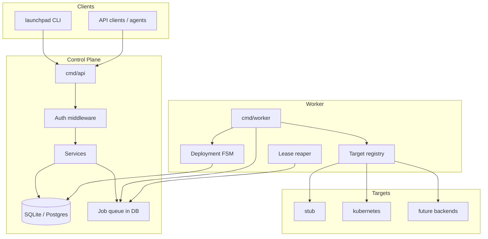

# Launchpad System Design

| Field | Value |
|-------|-------|
| **Status** | Active |
| **Date** | 2026-07-04 |
| **Domain model** | [`docs/DOMAIN.md`](DOMAIN.md) — authoritative for entities, invariants, and roadmap |

---

## Overview

Launchpad is a self-hosted deployment control plane with a Heroku-inspired developer experience. Users manage **projects** (logical systems), stage changes in **changesets**, and deploy **releases** asynchronously to pluggable runtime backends.

The system separates **control plane** (API, auth, persistence, job queue) from **data plane** (target backends that apply manifests and observe runtime). The API returns quickly with job IDs; the worker performs long-running deploys.

**Domain model is defined in [`DOMAIN.md`](DOMAIN.md).** This document covers control-plane architecture, storage, async execution, and operational concerns.

### Shipped today (MVP)

- Project / environment (`dev`) / service / process hierarchy
- Image-only releases, deploy worker, changeset workflow
- Stub and Kubernetes targets
- SQLite + Postgres storage, bootstrap token auth
- CLI: `projects create`, `use`, `config`, `changeset`, `deploy`, `ps`, `releases`

### Roadmap

See [Phased roadmap](#phased-roadmap) in this doc and [`DOMAIN.md`](DOMAIN.md) for multi-environment, multi-service, bindings, and promotion.

---

## Architecture



### Request flow (deploy)

1. Client `POST /v1/projects/{project}/releases` or `changeset/push`.
2. API transaction: snapshot config → create release → create deployment → enqueue job → `202 Accepted`.
3. Worker leases job, transitions deployment `pending → deploying`.
4. Worker calls `Target.Deploy` with resolved config and artifact.
5. On success: deployment `running`, release `succeeded`, project `running`.
6. On failure: deployment `failed`, release `failed`; previous running deployment stays live.

---

## Repository layout

```
cmd/
  api/           # HTTP server
  worker/        # Job consumer
  launchpad/     # CLI
  migrate/       # Schema migrations

internal/
  domain/        # Types, FSM, invariants (no I/O)
  store/         # SQL repositories + migrations/
  service/       # Business logic
  api/           # chi handlers, RFC 7807 errors
  auth/          # Token auth, scopes
  jobs/          # Worker loop
  target/        # Target interface, kubernetes/, stub/
  cli/           # cobra commands

pkg/
  apiclient/     # Go client (CLI)
  launchpad/     # Shared errors

docs/
  DOMAIN.md      # Domain model (read first)
  DESIGN.md      # This file

scripts/         # Dev utilities (e.g. smoke-stub.sh)
mise.toml        # Go toolchain
```

---

## Components

| Component | Responsibility |
|-----------|----------------|
| `cmd/api` | REST API, auth, validation, enqueue jobs |
| `cmd/worker` | Poll/lease jobs, run deployment FSM, call targets |
| `cmd/launchpad` | User-facing CLI |
| `internal/store` | Persistence, transactions, migrations |
| `internal/service` | Project bootstrap, config, releases, changesets |
| `internal/target/*` | Backend-specific deploy/scale/status/logs |

Workers scale horizontally via `FOR UPDATE SKIP LOCKED` job leasing. API processes are stateless.

---

## Storage

| Environment | Database | Driver |
|-------------|----------|--------|
| Local dev | SQLite | `modernc.org/sqlite` |
| Production | Postgres 15+ | `pgx/v5` |

Migrations live in `internal/store/migrations/`. Local dev can auto-migrate via `LAUNCHPAD_AUTO_MIGRATE=true`.

### Core tables (MVP)

`workspaces`, `projects`, `environments`, `services`, `processes`, `config_vars`, `releases`, `deployments`, `changesets`, `changeset_changes`, `jobs`, `api_tokens`

Schema details and invariants: [`DOMAIN.md`](DOMAIN.md).

---

## Job queue

Jobs are stored in Postgres/SQLite (no separate queue service in MVP).

| Status | Description |
|--------|-------------|
| `queued` | Waiting for worker |
| `leased` | Worker holds lock |
| `succeeded` / `failed` / `dead` | Terminal |

Workers poll with `FOR UPDATE SKIP LOCKED` (Postgres) or equivalent SQLite behavior. A lease reaper resets expired leases every 30s.

**MVP job types:** `deploy` only.

---

## Deployment state machine

```
pending → deploying → running | failed
pending → cancelled
deploying → cancelled
running → superseded   (when newer deployment reaches deploying)
```

Release status is coupled to deployment terminal state: `pending` → `succeeded` | `failed`.

Concurrency: at most one active deployment per `(service_id, environment_id)` via partial unique index.

---

## Target interface

```go
type DeployRequest struct {
    Project     domain.Project
    Service     domain.Service
    Environment domain.Environment
    Release     domain.Release
    Processes   []domain.Process
    Config      map[string]string
}
```

| Target | Registration |
|--------|--------------|
| `stub` | Always available (tests, local smoke) |
| `kubernetes` | When kubeconfig available; disable with `LAUNCHPAD_ENABLE_KUBERNETES=false` |

K8s resources: `launchpad-{project}-{service}-{process}` in the environment namespace.

---

## Authentication

Bootstrap via `LAUNCHPAD_BOOTSTRAP_TOKEN` when no admin tokens exist. Persistent tokens via `POST /v1/tokens`.

| Scope | Permissions |
|-------|-------------|
| `project:read` | GET projects, config, releases, processes, jobs |
| `project:write` | Create projects, patch config, stage changesets |
| `deploy` | Create releases, push changesets |
| `admin` | Token management |

Tokens are workspace-scoped. The default workspace `default` is seeded at migration.

---

## REST API (shipped)

Base path `/v1`. Errors: RFC 7807 (`application/problem+json`). Long operations return `202 Accepted`.

```
POST   /v1/projects
GET    /v1/projects
GET    /v1/projects/{project}
GET    /v1/projects/{project}/config
PATCH  /v1/projects/{project}/config
GET    /v1/projects/{project}/processes
POST   /v1/projects/{project}/releases
GET    /v1/projects/{project}/releases
GET    /v1/projects/{project}/changeset
POST   /v1/projects/{project}/changeset/changes
DELETE /v1/projects/{project}/changeset
POST   /v1/projects/{project}/changeset/push
GET    /v1/jobs/{id}
POST   /v1/tokens
GET    /healthz
```

Release source: `{"type":"image","image":"<artifact-ref>"}` only.

---

## CLI (shipped)

| Command | API |
|---------|-----|
| `launchpad projects create` | `POST /v1/projects` |
| `launchpad use` | Writes `~/.launchpad/config` |
| `launchpad config get/set` | GET/PATCH config |
| `launchpad changeset add/status/push/reset` | Changeset endpoints |
| `launchpad deploy --image` | `POST /releases` |
| `launchpad ps` | `GET /processes` |
| `launchpad releases` | `GET /releases` |

Context: `LAUNCHPAD_PROJECT`, `LAUNCHPAD_TOKEN`, `LAUNCHPAD_API_URL`. MVP operates on `dev` environment and primary service implicitly.

---

## Phased roadmap

| Phase | Status | Deliverable |
|-------|--------|-------------|
| **1 — MVP core** | **Done** | Project/env/service model, changeset, deploy, stub+K8s |
| **2 — Multi-env config** | Planned | `staging`/`prod`, shared/workspace config layers |
| **3 — Multi-service** | Planned | Multiple services, ReleaseSet, coordination modes |
| **4 — Bindings** | Planned | `${{ ref }}` config linking between services |
| **5 — Promotion** | Planned | `promote` across environments |
| **6 — Integrations** | Planned | `launchpad.yaml` import/export, agent/MCP hooks |

Each phase updates domain → store → service → worker → api → cli → target together.

---

## Future control-plane work

Not yet implemented; design targets retained for planning:

| Area | Intent |
|------|--------|
| **Observability** | Structured logs (slog), Prometheus metrics with route-template labels, OpenTelemetry |
| **Deployment events** | `deployment_events` table, SSE streams for deploy progress |
| **Idempotency** | `Idempotency-Key` header on mutating POSTs |
| **Rate limiting** | Per-token buckets; ingress as authoritative limiter in prod |
| **HA packaging** | Helm chart, API/worker replicas, migration Job, PDBs |
| **Builds** | In-cluster build service (Kaniko/Buildkit), `building` deploy state |
| **Secrets** | AES-GCM encryption for config vars at rest |
| **OpenAPI** | `docs/openapi.yaml` contract with CI diff check |

---

## Security notes

| Concern | MVP mitigation |
|---------|----------------|
| Stolen API token | Scoped tokens, revocation |
| Tenant crossover | Workspace ID enforced on every query |
| Config leakage in logs | Redact known secret keys (planned) |
| K8s RBAC | Dedicated ServiceAccount per Launchpad install |

Config vars are plaintext in DB in MVP; access controlled via DB permissions and network policy.

---

## Local development

```bash
mise install
mise exec -- make build test
make migrate-up
LAUNCHPAD_BOOTSTRAP_TOKEN=dev-bootstrap-token make run-api   # terminal 1
LAUNCHPAD_DATABASE_URL="file:launchpad.db" make run-worker   # terminal 2
```

Smoke test: `scripts/smoke-stub.sh` (API + worker must be running).

Agent and contributor conventions: [`AGENTS.md`](../AGENTS.md).

---

## Related documents

| Document | Purpose |
|----------|---------|
| [`DOMAIN.md`](DOMAIN.md) | Entity model, invariants, full CLI/API target state, glossary |
| [`AGENTS.md`](../AGENTS.md) | AI agent conventions, MVP scope, skills |
| [`README.md`](../README.md) | Quick start and user-facing overview |
| [`docs/superpowers/specs/2026-07-04-mvp-core-greenfield-design.md`](superpowers/specs/2026-07-04-mvp-core-greenfield-design.md) | Completed MVP implementation record |