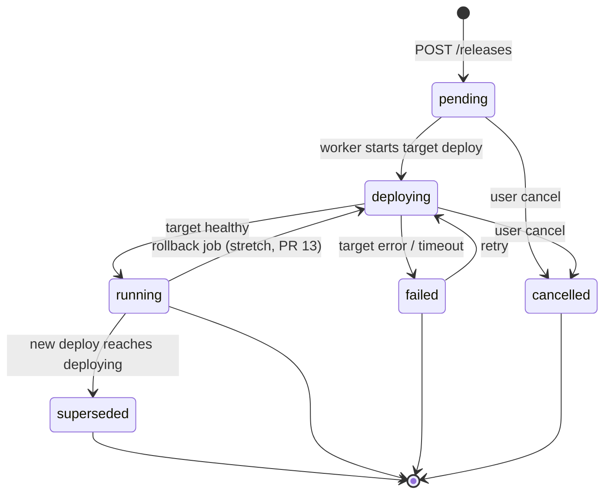
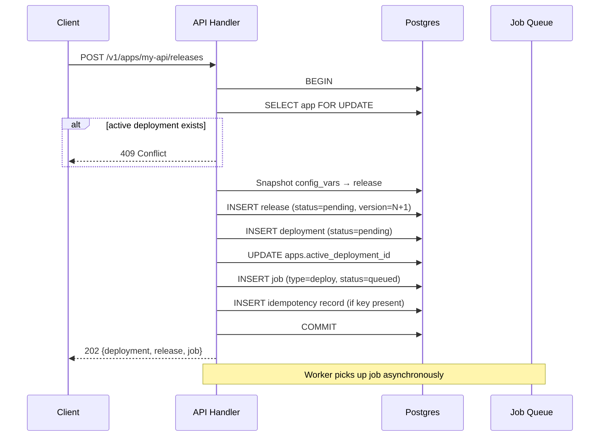
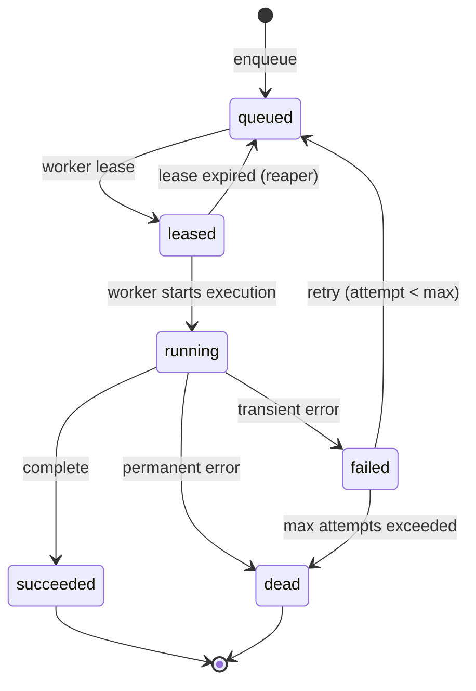

# Launchpad: Application Deployment & Management API

| Field | Value |
|-------|-------|
| **Author** | TBD |
| **Date** | 2026-06-26 |
| **Status** | Draft (revision 3) — **entity model superseded** |
| **Repository** | `/home/deck/Projects/launchpad` |

> **Domain model:** The entity hierarchy, config layers, changeset/ReleaseSet semantics, and lifecycle invariants are now defined in [`docs/DOMAIN.md`](DOMAIN.md) (2026-07-04). Sections below that describe Apps, entity relationships, Heroku mapping, and the v1 domain types reflect the pre-migration model and should be read in light of the new spec.

---

## Overview

Launchpad is a greenfield Go project that provides a Heroku/Deis-style Platform-as-a-Service (PaaS) abstraction for deploying and managing applications. Users interact via a CLI (`launchpad`) that talks to a REST API server; long-running operations (deploys, scaling, rollbacks) are executed asynchronously by a worker process against pluggable deployment backends, with Kubernetes as the initial target.

The system separates **control plane** concerns (API, auth, state, job orchestration) from **data plane** concerns (applying manifests, observing runtime). This split allows the API to return quickly with job IDs while workers perform minutes-long deploys, and allows new deployment targets (Nomad, ECS, bare metal) to be added without changing the CLI or core domain model.

**v1 deploy posture**: v1 accepts **pre-built container images only**. Archive/git build sources and the in-cluster build service are deferred to v1.1 (PR 16). The domain model retains `Build` entities and a `building` deployment state for forward compatibility, but these paths are unreachable in v1.

---

## Background & Motivation

### Current State

There is no existing codebase. Operators who want a self-hosted, Heroku-like workflow today must either:

- Use Heroku/Deis directly (vendor lock-in, limited backend choice), or
- Operate raw Kubernetes (steep learning curve, no unified app lifecycle model).

### Pain Points

| Pain Point | Impact |
|------------|--------|
| Deploy operations are long-running (push + rollout) | Synchronous APIs time out; poor UX |
| Each orchestrator has different primitives | No portable app/config/release mental model |
| Lack of unified audit trail | Hard to answer "what is running and why?" |
| CLI ergonomics vary per platform | High onboarding cost for developers |

### Why Launchpad

Launchpad standardizes the **app lifecycle** (create → configure → release → deploy → scale → rollback) behind a stable API and CLI, while delegating implementation details to a `Target` interface. Heroku API compatibility is pursued where it reduces friction (resource naming, config vars, releases), but Launchpad is not dogmatic about byte-for-byte compatibility.

---

## Goals & Non-Goals

### Goals

1. **Core domain model**: Apps, Releases, Builds (schema only in v1), Deployments, Config Vars, Processes/Scaling
2. **REST API** with Heroku-inspired paths and payloads where sensible
3. **Async job queue** for deploy, scale, rollback, and destroy operations
4. **Pluggable `Target` interface** with a production-quality Kubernetes implementation
5. **Explicit deployment state machine** with observable transitions and failure semantics
6. **CLI** (`launchpad`) that mirrors familiar `heroku`/`deis` workflows
7. **Durable storage** via Postgres (production) and SQLite (local dev), with versioned SQL migrations
8. **Authentication/authorization** with API tokens scoped to teams
9. **Observability**: structured logs, Prometheus metrics, OpenTelemetry traces, job event streams

### Non-Goals (v1)

- Multi-tenant billing, usage metering, or marketplace add-ons
- Built-in CI/CD pipeline designer
- **In-cluster build service** (archive/git sources, Kaniko/Buildkit) — deferred to v1.1 (PR 16)
- Full Heroku Platform API parity (e.g., add-ons, domains/SSL automation, pipelines)
- Web UI dashboard (CLI + API only for v1)
- Human user accounts / OIDC login (bootstrap tokens only; deferred to v2)
- Cross-region active-active HA for the control plane (single-region HA is in scope)
- Config-var encryption at rest (deferred to v1.1; v1 relies on DB access controls)

### MVP Cut Line

**MVP = through PR 12** (image-only, single-process `web` deploy, CLI `deploy`/`releases`/`ps`). MVP verification uses `GET /processes` (read-only, PR 10) and `GET /deployments` for deploy status. PR 13–15 are stretch goals for multi-process scale, rollback, SSE logs, and production Helm packaging.

---

## Proposed Design

### High-Level Architecture

```mermaid
flowchart TB
    subgraph clients [Clients]
        CLI[launchpad CLI]
        SDK[Future SDKs]
    end

    subgraph control [Control Plane]
        API[API Server<br/>cmd/api]
        AUTH[Auth Middleware]
        SVC[Domain Services]
        STORE[(Postgres / SQLite)]
        Q[Job Queue<br/>Postgres-backed]
    end

    subgraph async [Async Plane]
        WORKER[Worker<br/>cmd/worker]
        REAPER[Lease Reaper]
        SM[State Machine]
        REG[Target Registry]
    end

    subgraph targets [Deployment Targets]
        K8S[Kubernetes Target]
        FUTURE[Future: Nomad, ECS, ...]
    end

    subgraph runtime [Runtime Cluster]
        K8SAPI[Kubernetes API]
        PODS[Workloads]
    end

    CLI --> API
    SDK --> API
    API --> AUTH --> SVC --> STORE
    SVC --> Q
    WORKER --> Q
    REAPER --> Q
    WORKER --> SM --> STORE
    WORKER --> REG
    REG --> K8S
    REG --> FUTURE
    K8S --> K8SAPI --> PODS
```



### Repository Layout

```
/home/deck/Projects/launchpad/
├── cmd/
│   ├── api/              # HTTP API server
│   ├── worker/           # Async job consumer + lease reaper
│   └── launchpad/        # CLI entrypoint
├── internal/
│   ├── api/              # HTTP handlers, routing, middleware
│   ├── auth/             # Token validation, RBAC
│   ├── domain/           # Entities, state machines, invariants
│   ├── jobs/             # Job types, enqueue, lease, retry
│   ├── store/            # Repository interfaces + SQL impl
│   ├── service/          # Business logic orchestration
│   ├── target/           # Target interface + registry
│   │   └── kubernetes/   # K8s deployer implementation
│   └── observability/    # logging, metrics, tracing helpers
├── pkg/
│   ├── apiclient/        # Go client for API (used by CLI)
│   └── launchpad/        # Shared types, error codes
├── migrations/           # golang-migrate SQL files
├── deploy/               # K8s manifests, Helm chart for Launchpad itself
├── docs/
│   └── openapi.yaml
├── go.mod
└── Makefile
```

### Component Responsibilities

| Component | Responsibility | Scaling |
|-----------|----------------|---------|
| `cmd/api` | REST API, auth, validation, enqueue jobs, read-heavy queries | Horizontally (stateless) |
| `cmd/worker` | Poll/lease jobs, lease reaper, run state machine, call targets | Horizontally (competing consumers) |
| `cmd/launchpad` | User-facing CLI, config, output formatting | N/A (client) |
| `internal/store` | Persistence, transactions, optimistic locking | Via DB |
| `internal/target/*` | Backend-specific deploy/scale/destroy | Per-worker |

### Control Plane HA (Single-Region)

| Concern | v1 Design |
|---------|-----------|
| **API replicas** | 2+ pods behind Service; stateless; `readinessProbe: GET /healthz`, `livenessProbe: GET /healthz` |
| **Worker replicas** | 2+ pods; safe concurrent poll via `FOR UPDATE SKIP LOCKED`; no leader election required |
| **Lease reaper** | Runs in every worker goroutine; idempotent `UPDATE ... WHERE status='leased' AND leased_until < NOW()` |
| **Postgres** | Managed Postgres 15+ with streaming replica (read replica optional); failover via operator/cloud managed service |
| **Migrations** | Helm pre-upgrade **Job** (single-run); `LAUNCHPAD_AUTO_MIGRATE` disabled in prod |
| **Graceful drain** | Worker: `SIGTERM` → stop leasing new jobs, finish in-flight job (up to `terminationGracePeriodSeconds: 600`), release lease on timeout |
| **Split-brain** | Prevented by DB-level leasing; at-most-one worker holds a job lease at a time |
| **Rate limits** | In-process buckets are per-pod (see Rate Limiting); ingress/nginx enforces shared limits in production |

---

## Core Domain Model

### Entity Relationship (v1)

v1 does **not** include `User` or `TeamMember` entities. Authentication is API-token-only via bootstrap (see Authentication). Teams are seeded at install time.

```mermaid
erDiagram
    Team ||--o{ App : owns
    Team ||--o{ APIToken : has
    App ||--o{ ConfigVar : has
    App ||--o{ ProcessType : defines
    App ||--o| Deployment : active_deployment
    App ||--o{ Build : produces
    Build ||--o| Release : creates
    Release ||--o{ Deployment : triggers
    Deployment ||--o{ DeploymentEvent : logs
    App ||--o{ Job : enqueues

    App {
        uuid id PK
        string name UK
        uuid team_id FK
        uuid active_deployment_id FK
        string stack
        string target_type
        json target_config
        string status
        timestamp created_at
    }

    Build {
        uuid id PK
        uuid app_id FK
        string source_type
        string source_ref
        string image_ref
        string status
    }

    Release {
        uuid id PK
        uuid app_id FK
        uuid build_id FK
        int version UK_per_app
        json config_snapshot
        string status
    }

    Deployment {
        uuid id PK
        uuid app_id FK
        uuid release_id FK
        string status
        int version
        string target_ref
        timestamp started_at
        timestamp finished_at
    }

    ProcessType {
        uuid id PK
        uuid app_id FK
        string name
        string command
        int quantity
    }

    Job {
        uuid id PK
        string type
        uuid resource_id
        string status
        int attempt
        json payload
        timestamp run_at
        timestamp leased_until
    }
```

### Key Invariants

1. **App names** are unique per team, DNS-label safe (`^[a-z][a-z0-9-]{1,62}$`). API paths use **app name** (not UUID); names are immutable in v1.
2. **Release versions** are monotonically increasing per app (v1, v2, …); immutable once created.
3. **Only one active deployment** per app at a time, enforced by:
   - `apps.active_deployment_id` FK (nullable; set at deploy enqueue, cleared on terminal states)
   - Partial unique index: `UNIQUE(app_id) WHERE status IN ('pending','releasing','deploying')` on `deployments`
   - `SELECT ... FOR UPDATE` on `apps` row during deploy enqueue transaction
4. **Config vars** are stored separately; a Release snapshots config at **API POST time** (synchronous).
5. **ProcessType.quantity** represents desired replica count; actual count is observed from target.
6. **Default process**: `POST /v1/apps` auto-creates a `web` process type with `quantity=1`.
7. **Destroy** is a **soft delete**: `apps.status='destroying'` → `'destroyed'`; row retained 30 days for audit, then hard-deleted by retention job.

### Domain Types (Go)

```go
// internal/domain/app.go
type App struct {
    ID                  uuid.UUID
    TeamID              uuid.UUID
    Name                string
    ActiveDeploymentID  *uuid.UUID
    Stack               string
    TargetType          string
    TargetConfig        json.RawMessage
    Status              AppStatus  // created | deploying | running | failed | maintenance | destroying | destroyed
    CreatedAt           time.Time
    UpdatedAt           time.Time
    DeletedAt           *time.Time
}
```

```go
// internal/domain/deployment.go
type DeploymentStatus string

const (
    DeploymentPending    DeploymentStatus = "pending"
    DeploymentBuilding   DeploymentStatus = "building"   // unreachable in v1
    DeploymentReleasing  DeploymentStatus = "releasing"    // unreachable in v1 (release created at API time)
    DeploymentDeploying  DeploymentStatus = "deploying"
    DeploymentRunning    DeploymentStatus = "running"
    DeploymentFailed     DeploymentStatus = "failed"
    DeploymentSuperseded DeploymentStatus = "superseded"
    DeploymentRolledBack DeploymentStatus = "rolled_back"
    DeploymentCancelled  DeploymentStatus = "cancelled"
)

type Deployment struct {
    ID         uuid.UUID
    AppID      uuid.UUID
    ReleaseID  uuid.UUID
    Status     DeploymentStatus
    Version    int           // optimistic locking for event writes
    TargetRef  string
    Message    string
    StartedAt  time.Time
    FinishedAt *time.Time
}
```

### v1 Source Validation

`POST /v1/apps/{app}/releases` rejects non-image sources at API validation:

```go
func validateReleaseSource(src ReleaseSource) error {
    if src.Type != "image" {
        return ErrNotImplemented // 501: build service not available in v1
    }
    if src.Image == "" {
        return ErrValidation("image ref required")
    }
    return nil
}
```

Build endpoints (`POST /v1/apps/{app}/builds`, etc.) return **`501 Not Implemented`** in v1 with body pointing to v1.1 build support.

---

## Deployment Lifecycle State Machine

### v1 State Diagram

In v1, deploy flow is: `pending → deploying → running|failed`. States `building` and `releasing` exist in the enum for forward compatibility but are **not entered** because release records are created synchronously at API POST time.



### Transition Rules

| From | To | Trigger | Side Effects |
|------|-----|---------|--------------|
| `pending` | `deploying` | Worker picks deploy job (v1) | Call `Target.Deploy`; emit event; release stays `pending` |
| `deploying` | `running` | Target reports ready | Set `app.status=running`; release → `succeeded`; clear active lock on completion |
| `deploying` | `failed` | Target error or 15m timeout | Release → `failed`; emit failure event; previous `running` deployment stays live |
| `running` | `superseded` | New deployment reaches `deploying` | Set `finished_at`; emit `superseded` event |
| `running` | `deploying` | `POST /releases/{v}/rollback` (PR 13) | New deployment row; K8s rollout to prior image; on failure → `failed` (not `rolled_back`) |
| `pending` | `cancelled` | User cancel | Release → `failed`; clear `active_deployment_id`; cancel job |
| `deploying` | `cancelled` | User cancel | Release → `failed`; target cancel if possible; K8s rollout undo |
| `*` (non-terminal active) | `cancelled` | User cancel | See cancel rules below |

### Release Status Lifecycle

Release status is **coupled to its deployment** and updated by the worker on deployment terminal transitions (PR 10):

| Release Status | Condition |
|----------------|-----------|
| `pending` | Deployment is `pending` or `deploying` |
| `succeeded` | Deployment → `running` |
| `failed` | Deployment → `failed` or `cancelled` |

```go
// internal/domain/release.go
type ReleaseStatus string

const (
    ReleasePending   ReleaseStatus = "pending"
    ReleaseSucceeded ReleaseStatus = "succeeded"
    ReleaseFailed    ReleaseStatus = "failed"
)
```

Worker updates release status in the same transaction as deployment state transitions. `GET /releases/{version}` after a successful deploy returns `status: "succeeded"`.

> **Note**: `DeploymentRolledBack` exists in the enum for forward compatibility but is **not entered in v1**. Rollback failures (PR 13) use deployment `failed`; there is no `deploying → rolled_back` transition.

**`superseded` semantics**:
- Terminal state; not counted as "active" for 409 conflict checks
- Occurs when a newer deployment transitions to `deploying` (not at enqueue time)
- `GET /deployments/{id}` returns `status: "superseded"` with `finished_at` set
- Superseded deployments remain queryable for audit

**Rollback semantics** (primary path: `running → deploying → running`):
1. `POST /v1/apps/{app}/releases/{version}/rollback` creates a **new Release** (version N+1) with `description="Rollback to v{version}"` and `config_snapshot` copied from the target release
2. A new **Deployment** is enqueued referencing the new release
3. Worker calls `Target.Deploy` with the **old release's image** (from `builds.image_ref` or release metadata)
4. On success: deployment → `running`, release → `succeeded`; on failure: deployment → `failed`, release → `failed` (previous deployment remains `superseded` or `running` depending on K8s rollout outcome)
5. Kubernetes: uses Deployment rollout with prior ReplicaSet template (not just `kubectl rollout undo`, but equivalent effect)

### Release & Deployment Creation (API Transaction)

The API creates `Release` + `Deployment` + `Job` **synchronously** in one transaction at `POST /releases` time:



**`GET /releases/{version}` while pending**: Returns the release with `status: "pending"` and associated deployment ID. Config snapshot reflects values at POST time.

### Concurrency Control

Single authoritative mechanism (no `deploy_lock` column):

1. **Pessimistic**: `SELECT ... FOR UPDATE` on `apps` row during deploy enqueue
2. **FK**: `apps.active_deployment_id` → `deployments.id` (set at enqueue, cleared when deployment reaches terminal state)
3. **Partial unique index**: `CREATE UNIQUE INDEX deployments_one_active_per_app ON deployments(app_id) WHERE status IN ('pending','deploying')`
4. **Optimistic**: `deployments.version` incremented on each event write (prevents lost updates to event stream)

Duplicate deploy requests while active → `409 Conflict` with `active_deployment_id`.

### Cancel Semantics

| Deployment Status | Cancellable? | Behavior |
|-------------------|--------------|----------|
| `pending` | Yes | Cancel job; clear `active_deployment_id`; → `cancelled` |
| `deploying` | Yes | Signal target cancel; K8s rollout undo; → `cancelled` |
| `running` | No | Use rollback or new deploy instead |
| `releasing` | N/A in v1 | State unreachable (release created at API time) |

---

## REST API Design

### Conventions

- Base path: `/v1`
- JSON request/response bodies
- Errors follow RFC 7807 (`application/problem+json`)
- Long operations return `202 Accepted` with a `Job` or `Deployment` resource
- Pagination: `?page=1&per_page=50` (Heroku-style)
- Filtering: `?status=running`
- **Path identifiers**: `{app}` is the app **name** (team-scoped), not UUID
- **OpenAPI**: Every API-touching PR must update `docs/openapi.yaml`; CI enforces diff check from PR 6 onward

### Idempotency

Expensive mutating endpoints accept an optional idempotency header:

```
Idempotency-Key: <client-generated-uuid>
```

| Endpoint | Idempotency | TTL |
|----------|-------------|-----|
| `POST /v1/apps/{app}/releases` | Yes | 24 hours |
| `POST /v1/apps/{app}/releases/{v}/rollback` | Yes | 24 hours |
| `DELETE /v1/apps/{app}` | Yes | 24 hours |
| `PATCH /v1/apps/{app}/processes/{name}/scale` | Yes | 1 hour |
| `POST /v1/apps/{app}/builds` | Yes (v1.1) | 24 hours |

**Storage**:

```sql
CREATE TABLE idempotency_keys (
    key           TEXT NOT NULL,
    team_id       UUID NOT NULL,
    endpoint      TEXT NOT NULL,
    request_hash  BYTEA NOT NULL,
    response_code INT NOT NULL,
    response_body JSONB NOT NULL,
    created_at    TIMESTAMPTZ NOT NULL DEFAULT NOW(),
    expires_at    TIMESTAMPTZ NOT NULL,
    PRIMARY KEY (team_id, key)
);
```

**Behavior**:
- Same key + same `request_hash` → return stored `response_code` + `response_body` (including original job/deployment IDs)
- Same key + different `request_hash` → `422 Unprocessable Entity`
- Missing key → normal execution (no idempotency)

### Rate Limiting

| Scope | Limit | Window |
|-------|-------|--------|
| Per token (default) | 300 requests | 1 minute |
| Per token (`POST /releases`, rollback) | 10 requests | 1 minute |
| Per token (SSE log streams) | 5 concurrent | — |
| Per team (aggregate) | 1000 requests | 1 minute |

Implemented as middleware in `internal/api` (PR 6), backed by in-memory token bucket **per API process**.

**v1 limitation (multi-replica)**: With 2+ stateless API replicas behind a load balancer, effective per-token limits become approximately `N × documented limit` because buckets are not shared across pods. This is acceptable for v1 MVP.

**Production mitigation**: Helm chart configures **ingress/nginx rate limits** as the authoritative enforcement layer (same numeric limits as the table above). In-process limits act as a best-effort first line of defense on each pod.

**v1.1 upgrade path**: Redis-backed token bucket (`internal/api/ratelimit/redis.go`) for shared state across replicas.

Limits documented in OpenAPI `x-rateLimit` extensions.

### Heroku Compatibility Mapping

| Heroku | Launchpad | Notes |
|--------|-----------|-------|
| `POST /apps` | `POST /v1/apps` | Compatible shape |
| `GET /apps/{id}/config-vars` | `GET /v1/apps/{app}/config-vars` | Key-value map |
| `PATCH /apps/{id}/config-vars` | `PATCH /v1/apps/{app}/config-vars` | Merge patch |
| `POST /apps/{id}/releases` | `POST /v1/apps/{app}/releases` | Triggers async deploy |
| `GET /apps/{id}/releases` | `GET /v1/apps/{app}/releases` | Paginated |
| `POST /apps/{id}/dynos` | `POST /v1/apps/{app}/processes` | Renamed for clarity |
| `PATCH /apps/{id}/dynos` | `PATCH /v1/apps/{app}/processes/{name}/scale` | Explicit scale endpoint |

### Endpoint Catalog

#### Apps

```
POST   /v1/apps                          Create app (auto-creates web process)
GET    /v1/apps                          List apps (team-scoped)
GET    /v1/apps/{app}                    Get app
PATCH  /v1/apps/{app}                    Update app metadata
DELETE /v1/apps/{app}                    Destroy app (async job, soft delete)
```

#### Config Vars

```
GET    /v1/apps/{app}/config-vars
PATCH  /v1/apps/{app}/config-vars        { "KEY": "value", "OTHER": null }
```

#### Builds (v1: not implemented)

```
POST   /v1/apps/{app}/builds             → 501 Not Implemented
GET    /v1/apps/{app}/builds             → 501 Not Implemented
GET    /v1/apps/{app}/builds/{build_id}  → 501 Not Implemented
GET    /v1/apps/{app}/builds/{build_id}/logs → 501 Not Implemented
```

#### Releases & Deployments

```
POST   /v1/apps/{app}/releases           Create release + trigger deploy (image only)
GET    /v1/apps/{app}/releases
GET    /v1/apps/{app}/releases/{version}
POST   /v1/apps/{app}/releases/{version}/rollback

GET    /v1/apps/{app}/deployments
GET    /v1/apps/{app}/deployments/{id}
GET    /v1/apps/{app}/deployments/{id}/events
POST   /v1/apps/{app}/deployments/{id}/cancel
```

#### Processes / Scaling

```
GET    /v1/apps/{app}/processes                          MVP (PR 10): read-only
PATCH  /v1/apps/{app}/processes/{name}/scale             Stretch (PR 13): { "quantity": 3 }
GET    /v1/apps/{app}/processes/{name}/logs              Stretch (PR 14): runtime log stream
```

#### Jobs (generic async status)

```
GET    /v1/jobs/{id}                                     MVP (PR 6): poll-only status
GET    /v1/jobs/{id}/events                              Stretch (PR 11): SSE proxy to deployment events
```

#### Auth & Tokens

```
POST   /v1/tokens                        Create API token (admin scope)
GET    /v1/tokens                        List tokens (metadata only, no secrets)
DELETE /v1/tokens/{id}                   Revoke token (immediate)
GET    /v1/teams                         List teams (read-only in v1)
```

Team creation and membership management are **not** exposed via API in v1; teams are seeded at install (see Bootstrap).

### `web_url` Derivation

| Condition | `web_url` value |
|-----------|-----------------|
| Ingress enabled (default) | `https://{app_name}.{LAUNCHPAD_BASE_DOMAIN}` |
| Ingress disabled | Field **omitted** from response |
| Internal-only mode | `http://launchpad-{app}-web.{namespace}.svc.cluster.local` (only when `LAUNCHPAD_EXPOSE_INTERNAL_URL=true`) |

Configuration:
- `LAUNCHPAD_BASE_DOMAIN` — e.g. `launchpad.example.com` (required for ingress mode)
- `LAUNCHPAD_INGRESS_ENABLED` — default `true`
- TLS via cert-manager annotation template on Ingress: `cert-manager.io/cluster-issuer: {LAUNCHPAD_TLS_ISSUER}`

### Example: Create App + Deploy

**Request**

```http
POST /v1/apps
Authorization: Bearer lp_abc123
Content-Type: application/json

{
  "name": "my-api",
  "team": "acme",
  "target": {
    "type": "kubernetes",
    "namespace": "acme-prod",
    "cluster": "default"
  }
}
```

**Response `201 Created`**

```json
{
  "id": "550e8400-e29b-41d4-a716-446655440000",
  "name": "my-api",
  "team": "acme",
  "status": "created",
  "web_url": "https://my-api.launchpad.example.com",
  "created_at": "2026-06-26T12:00:00Z"
}
```

**Deploy**

```http
POST /v1/apps/my-api/releases
Idempotency-Key: 7f3c2a1b-9e8d-4c5b-a3f2-1d0e9f8a7b6c
Content-Type: application/json

{
  "source": {
    "type": "image",
    "image": "registry.example.com/my-api:v1.2.3"
  },
  "description": "Deploy v1.2.3"
}
```

**Response `202 Accepted`**

```json
{
  "deployment": {
    "id": "7c9e6679-7425-40de-944b-e07fc1f90ae7",
    "status": "pending",
    "release": { "version": 3, "status": "pending" }
  },
  "job": {
    "id": "a1b2c3d4-e5f6-7890-abcd-ef1234567890",
    "type": "deploy",
    "status": "queued"
  }
}
```

---

## Async Job Queue

### Design Choice: Postgres-Backed Queue (v1)

Jobs live in the same Postgres database as domain data, supporting transactional enqueue. At expected v1 load (< 100 jobs/min), polling with `FOR UPDATE SKIP LOCKED` is sufficient.

**Upgrade path**: Swap `internal/jobs/queue` implementation to NATS JetStream or Redis Streams without changing worker handlers.

### Job Status State Machine



| Status | Retriable? | Description |
|--------|------------|-------------|
| `queued` | — | Waiting for worker |
| `leased` | — | Worker holds lock; reaper reclaims on expiry |
| `running` | — | Actively executing |
| `succeeded` | No | Terminal success |
| `failed` | Yes | Transient failure; re-queued with backoff |
| `dead` | No | Permanent failure or max attempts exceeded |

### Job Schema

```sql
CREATE TABLE jobs (
    id            UUID PRIMARY KEY,
    type          TEXT NOT NULL,       -- deploy | scale | destroy | rollback (build in v1.1)
    resource_type TEXT NOT NULL,
    resource_id   UUID NOT NULL,
    status        TEXT NOT NULL,       -- queued | leased | running | succeeded | failed | dead
    payload       JSONB NOT NULL,
    attempt       INT NOT NULL DEFAULT 0,
    max_attempts  INT NOT NULL DEFAULT 5,
    run_at        TIMESTAMPTZ NOT NULL DEFAULT NOW(),
    leased_until  TIMESTAMPTZ,
    leased_by     TEXT,
    last_error    TEXT,
    created_at    TIMESTAMPTZ NOT NULL DEFAULT NOW(),
    updated_at    TIMESTAMPTZ NOT NULL DEFAULT NOW()
);

CREATE INDEX jobs_poll_idx ON jobs (status, run_at)
    WHERE status IN ('queued', 'failed');

CREATE INDEX jobs_lease_reclaim_idx ON jobs (leased_until)
    WHERE status = 'leased';
```

### Job Leasing & Reaper

```go
// internal/jobs/lease.go — worker poll
func (s *Store) LeaseNext(ctx context.Context, workerID string, types []string) (*Job, error) {
    // BEGIN;
    // SELECT * FROM jobs
    //   WHERE status IN ('queued','failed') AND run_at <= NOW() AND type = ANY($types)
    //   ORDER BY run_at FOR UPDATE SKIP LOCKED LIMIT 1;
    // UPDATE jobs SET status='leased', leased_until=NOW()+interval '5 min',
    //                 leased_by=$workerID, updated_at=NOW();
    // COMMIT;
}

// internal/jobs/reaper.go — runs every 30s in each worker
func (r *Reaper) ReclaimExpired(ctx context.Context) (int, error) {
    // UPDATE jobs SET status='queued', leased_until=NULL, leased_by=NULL, updated_at=NOW()
    //   WHERE status='leased' AND leased_until < NOW();
}
```

### Worker Idempotency (per job type)

| Job Type | Partial Failure Handling |
|----------|--------------------------|
| `deploy` | Before `Target.Deploy`, check if deployment already `running` with matching `target_ref` → succeed. K8s apply is upsert-based (idempotent). On retry after partial apply, re-read Deployment status and continue polling. |
| `scale` | Read current replica count; skip if already at desired quantity |
| `rollback` | Same as deploy; idempotent apply of prior release image |
| `destroy` | Delete K8s resources; ignore `NotFound` errors; retry remaining resources |

### Retry Policy

| Job Type | Max Attempts | Backoff |
|----------|--------------|---------|
| `deploy` | 5 | 10s, 30s, 2m, 5m, 15m |
| `scale` | 5 | 5s exponential |
| `rollback` | 5 | 10s, 30s, 2m, 5m, 15m |
| `destroy` | 10 | 30s exponential |

Permanent failures (invalid image, RBAC denied) → `dead` immediately (no retry).

### SQLite vs Postgres Queue Parity

| Concern | Postgres | SQLite (modernc) |
|---------|----------|------------------|
| `FOR UPDATE SKIP LOCKED` | Native | Supported in SQLite 3.39+; **pin `modernc.org/sqlite >= 1.29`** |
| `JSONB` | Native | `TEXT` with JSON validation in app layer |
| `TEXT[]` scopes | Native | `TEXT` JSON array |
| Concurrent workers | Full support | Single worker recommended for local dev |

**CI requirement** (PR 7): integration tests for `LeaseNext` and `ReclaimExpired` run on **both** drivers.

---

## Pluggable Target Interface

### Interface Definition

```go
// internal/target/target.go
type Target interface {
    Type() string
    Deploy(ctx context.Context, req DeployRequest) (*DeployResult, error)
    Scale(ctx context.Context, req ScaleRequest) error
    Destroy(ctx context.Context, req DestroyRequest) error
    Rollback(ctx context.Context, req RollbackRequest) (*DeployResult, error)
    Status(ctx context.Context, req StatusRequest) (*RuntimeStatus, error)
    Logs(ctx context.Context, req LogsRequest) (io.ReadCloser, error)
}
```

### Kubernetes Target (v1)

**Namespace strategy**: Use **shared namespace** from `app.target_config.namespace` (required field). Launchpad does not auto-create per-app namespaces in v1; all resources for an app are prefixed `launchpad-{app}-*`.

| Launchpad Concept | Kubernetes Resource |
|-------------------|---------------------|
| App | Resource prefix within `target_config.namespace` |
| Release | `Deployment` annotation `launchpad.dev/release-version` |
| Process type `web` | `Deployment/launchpad-{app}-web` |
| Config vars | `Secret/launchpad-{app}-config` + envFrom |
| Service exposure | `Service` + `Ingress` (when enabled) |

**Readiness criteria**: All deployments reach `Available=True` and `readyReplicas == spec.replicas` within **15 minutes** (configurable).

---

## CLI Architecture

### Log Channels

Three distinct log sources with explicit CLI routing:

| Channel | Source | API | CLI Default |
|---------|--------|-----|-------------|
| **events** | `deployment_events` table | `GET /v1/apps/{app}/deployments/{id}/events` (SSE) | `launchpad releases` wait output |
| **runtime** | Target backend (K8s pod logs) | `GET /v1/apps/{app}/processes/{name}/logs` (stream) | `launchpad logs` default |
| **build** | Build service (v1.1) | `GET /v1/apps/{app}/builds/{id}/logs` (SSE) | `launchpad builds:logs` (v1.1) |

```bash
launchpad logs --process web              # runtime (default)
launchpad logs --source=runtime         # explicit runtime
launchpad logs --source=events --deploy <id>  # deploy event stream
launchpad logs --source=build --build <id>    # v1.1 only
```

### Command Mapping

| Command | API Calls |
|---------|-----------|
| `launchpad apps:create -t acme -n my-api` | `POST /v1/apps` |
| `launchpad config:set KEY=val` | `PATCH /v1/apps/{app}/config-vars` |
| `launchpad deploy --image=...` | `POST /v1/apps/{app}/releases` |
| `launchpad ps` | `GET /v1/apps/{app}/processes` |
| `launchpad logs --process web` | `GET /v1/apps/{app}/processes/web/logs` |
| `launchpad rollback v2` | `POST /v1/apps/{app}/releases/2/rollback` |

---

## Storage Layer

### Technology

| Environment | Database | Driver |
|-------------|----------|--------|
| Local dev | SQLite | `modernc.org/sqlite` (pure Go, >= 1.29) |
| Production | Postgres 15+ | `pgx/v5` |

### Full Schema (Postgres)

```sql
-- migrations/001_initial.up.sql

CREATE TABLE teams (
    id         UUID PRIMARY KEY,
    name       TEXT UNIQUE NOT NULL,
    created_at TIMESTAMPTZ NOT NULL DEFAULT NOW()
);

CREATE TABLE apps (
    id                     UUID PRIMARY KEY,
    team_id                UUID NOT NULL REFERENCES teams(id),
    name                   TEXT NOT NULL,
    stack                  TEXT NOT NULL DEFAULT 'container',
    target_type            TEXT NOT NULL DEFAULT 'kubernetes',
    target_config          JSONB NOT NULL DEFAULT '{}',
    status                 TEXT NOT NULL DEFAULT 'created',
    active_deployment_id   UUID,  -- FK added after deployments table
    created_at             TIMESTAMPTZ NOT NULL DEFAULT NOW(),
    updated_at             TIMESTAMPTZ NOT NULL DEFAULT NOW(),
    deleted_at             TIMESTAMPTZ,
    UNIQUE (team_id, name)
);

CREATE TABLE config_vars (
    app_id     UUID NOT NULL REFERENCES apps(id) ON DELETE CASCADE,
    key        TEXT NOT NULL,
    value      TEXT NOT NULL,
    created_at TIMESTAMPTZ NOT NULL DEFAULT NOW(),
    updated_at TIMESTAMPTZ NOT NULL DEFAULT NOW(),
    PRIMARY KEY (app_id, key)
);

CREATE TABLE process_types (
    id         UUID PRIMARY KEY,
    app_id     UUID NOT NULL REFERENCES apps(id) ON DELETE CASCADE,
    name       TEXT NOT NULL,
    command    TEXT NOT NULL DEFAULT '',
    quantity   INT NOT NULL DEFAULT 1,
    created_at TIMESTAMPTZ NOT NULL DEFAULT NOW(),
    updated_at TIMESTAMPTZ NOT NULL DEFAULT NOW(),
    UNIQUE (app_id, name)
);

CREATE TABLE builds (
    id          UUID PRIMARY KEY,
    app_id      UUID NOT NULL REFERENCES apps(id) ON DELETE CASCADE,
    source_type TEXT NOT NULL,
    source_ref  TEXT NOT NULL DEFAULT '',
    image_ref   TEXT NOT NULL DEFAULT '',
    status      TEXT NOT NULL DEFAULT 'pending',
    logs_url    TEXT,
    created_at  TIMESTAMPTZ NOT NULL DEFAULT NOW(),
    updated_at  TIMESTAMPTZ NOT NULL DEFAULT NOW()
);

CREATE TABLE releases (
    id              UUID PRIMARY KEY,
    app_id          UUID NOT NULL REFERENCES apps(id) ON DELETE CASCADE,
    build_id        UUID REFERENCES builds(id),
    version         INT NOT NULL,
    config_snapshot JSONB NOT NULL DEFAULT '{}',
    image_ref       TEXT NOT NULL,          -- denormalized for v1 image-only deploys
    status          TEXT NOT NULL DEFAULT 'pending',
    description     TEXT NOT NULL DEFAULT '',
    created_at      TIMESTAMPTZ NOT NULL DEFAULT NOW(),
    UNIQUE (app_id, version)
);

CREATE TABLE deployments (
    id          UUID PRIMARY KEY,
    app_id      UUID NOT NULL REFERENCES apps(id) ON DELETE CASCADE,
    release_id  UUID NOT NULL REFERENCES releases(id),
    status      TEXT NOT NULL DEFAULT 'pending',
    version     INT NOT NULL DEFAULT 1,     -- optimistic locking for events
    target_ref  TEXT NOT NULL DEFAULT '',
    message     TEXT NOT NULL DEFAULT '',
    started_at  TIMESTAMPTZ NOT NULL DEFAULT NOW(),
    finished_at TIMESTAMPTZ,
    created_at  TIMESTAMPTZ NOT NULL DEFAULT NOW(),
    updated_at  TIMESTAMPTZ NOT NULL DEFAULT NOW()
);

CREATE UNIQUE INDEX deployments_one_active_per_app
    ON deployments(app_id)
    WHERE status IN ('pending', 'deploying');

CREATE INDEX deployments_app_id_created_at_idx
    ON deployments(app_id, created_at DESC);

ALTER TABLE apps
    ADD CONSTRAINT apps_active_deployment_id_fkey
    FOREIGN KEY (active_deployment_id) REFERENCES deployments(id);

CREATE TABLE deployment_events (
    id            UUID PRIMARY KEY,
    deployment_id UUID NOT NULL REFERENCES deployments(id) ON DELETE CASCADE,
    type          TEXT NOT NULL,            -- state_change | log | error
    message       TEXT NOT NULL,
    metadata      JSONB NOT NULL DEFAULT '{}',
    created_at    TIMESTAMPTZ NOT NULL DEFAULT NOW()
);

CREATE INDEX deployment_events_deployment_id_created_at_idx
    ON deployment_events(deployment_id, created_at);

CREATE TABLE jobs (
    id            UUID PRIMARY KEY,
    type          TEXT NOT NULL,
    resource_type TEXT NOT NULL,
    resource_id   UUID NOT NULL,
    status        TEXT NOT NULL DEFAULT 'queued',
    payload       JSONB NOT NULL,
    attempt       INT NOT NULL DEFAULT 0,
    max_attempts  INT NOT NULL DEFAULT 5,
    run_at        TIMESTAMPTZ NOT NULL DEFAULT NOW(),
    leased_until  TIMESTAMPTZ,
    leased_by     TEXT,
    last_error    TEXT,
    created_at    TIMESTAMPTZ NOT NULL DEFAULT NOW(),
    updated_at    TIMESTAMPTZ NOT NULL DEFAULT NOW()
);

CREATE INDEX jobs_poll_idx ON jobs (status, run_at)
    WHERE status IN ('queued', 'failed');

CREATE INDEX jobs_lease_reclaim_idx ON jobs (leased_until)
    WHERE status = 'leased';

CREATE TABLE api_tokens (
    id          UUID PRIMARY KEY,
    team_id     UUID REFERENCES teams(id),
    name        TEXT NOT NULL,
    token_hash  BYTEA NOT NULL,
    scopes      TEXT[] NOT NULL,
    expires_at  TIMESTAMPTZ,
    revoked_at  TIMESTAMPTZ,
    created_at  TIMESTAMPTZ NOT NULL DEFAULT NOW()
);

CREATE INDEX api_tokens_hash_idx ON api_tokens(token_hash)
    WHERE revoked_at IS NULL;

CREATE TABLE idempotency_keys (
    key           TEXT NOT NULL,
    team_id       UUID NOT NULL,
    endpoint      TEXT NOT NULL,
    request_hash  BYTEA NOT NULL,
    response_code INT NOT NULL,
    response_body JSONB NOT NULL,
    created_at    TIMESTAMPTZ NOT NULL DEFAULT NOW(),
    expires_at    TIMESTAMPTZ NOT NULL,
    PRIMARY KEY (team_id, key)
);

CREATE INDEX idempotency_keys_expires_at_idx ON idempotency_keys(expires_at);
```

### SQLite Divergences (`migrations/001_initial.sqlite.up.sql`)

| Postgres | SQLite |
|----------|--------|
| `UUID` | `TEXT` |
| `JSONB` | `TEXT` |
| `BYTEA` | `BLOB` |
| `TEXT[]` scopes | `TEXT` (JSON array) |
| `TIMESTAMPTZ` | `TEXT` (RFC3339) |
| Partial unique index | Supported in SQLite 3.8+ |

### Event Retention

| Data | Online Retention | Archive |
|------|------------------|---------|
| `deployment_events` | 90 days | Export to object storage (optional), then delete |
| `jobs` (terminal) | 30 days | Delete |
| `idempotency_keys` | TTL-based (1–24h) | Delete on expiry |

Retention enforced by daily cron job in worker (`internal/jobs/retention.go`).

### Storage Estimates (Year 1)

| Table | Rows (est.) | Total |
|-------|-------------|-------|
| deployment_events | 500,000 | ~250 MB (before retention pruning) |
| jobs | 50,000 | ~100 MB |
| **Total** | | < 500 MB after retention |

---

## Authentication & Authorization

### v1 Model: Bootstrap Tokens (No User Accounts)

v1 has **no `users` or `team_members` tables**. Operators bootstrap the system via environment variable:

```bash
# Valid only when no admin tokens exist; expires after first use or 24h
LAUNCHPAD_BOOTSTRAP_TOKEN=lp_bootstrap_<random>
```

**First-run flow** (runtime-only bootstrap — migrations do **not** read env or insert tokens):

1. Operator sets `LAUNCHPAD_BOOTSTRAP_TOKEN` in Helm values or API server env (not migration Job env)
2. Seed migration creates default team (`default`) only — **no `api_tokens` rows**
3. Auth middleware: when `api_tokens` has zero rows with `admin` scope, accept bearer token whose SHA-256 hash matches `SHA256(LAUNCHPAD_BOOTSTRAP_TOKEN)` from **runtime env**
4. Operator calls `POST /v1/tokens` with bootstrap bearer to create first persistent admin token (stored hashed in DB)
5. Bootstrap path disabled once any `admin`-scoped token exists in `api_tokens`; bootstrap bearer rejected after `LAUNCHPAD_BOOTSTRAP_TOKEN_EXPIRES` (default 24h from first API server start, tracked in memory or `system_metadata` table)

```go
// internal/auth/bootstrap.go — runtime validation only
func ValidateBootstrap(ctx context.Context, bearer string, store Store) (bool, error) {
    if hasAdminToken, _ := store.Tokens().HasAdminScope(ctx); hasAdminToken {
        return false, nil
    }
    expected := os.Getenv("LAUNCHPAD_BOOTSTRAP_TOKEN")
    return subtle.ConstantTimeCompare([]byte(hashToken(bearer)), []byte(hashToken(expected))) == 1, nil
}
```

### Token Lifecycle

```
POST   /v1/tokens          Create token (returns plaintext once)
GET    /v1/tokens          List tokens (id, name, scopes, expires_at; no secret)
DELETE /v1/tokens/{id}     Revoke token (sets revoked_at; immediate effect)
```

**Revocation**: Soft-delete via `revoked_at` timestamp. Auth middleware checks `revoked_at IS NULL AND (expires_at IS NULL OR expires_at > NOW())`. No in-memory cache in v1 (DB lookup per request; add cache in v1.1 if needed).

### Scopes

| Scope | Permissions |
|-------|-------------|
| `app:read` | GET apps, config, releases, deployments, processes |
| `app:write` | Create/update/delete apps, config vars |
| `deploy` | Create releases, rollback, cancel deployments |
| `scale` | Scale processes |
| `admin` | Token management |

---

## Observability

### Metrics (Prometheus)

**Cardinality rule**: HTTP metrics use **route template** labels, not raw paths.

| Metric | Type | Labels |
|--------|------|--------|
| `launchpad_http_requests_total` | Counter | `method`, `route`, `status` |
| `launchpad_http_request_duration_seconds` | Histogram | `method`, `route` |
| `launchpad_jobs_total` | Counter | `type`, `status` |
| `launchpad_job_duration_seconds` | Histogram | `type` |
| `launchpad_deployments_active` | Gauge | `status` |
| `launchpad_target_operations_total` | Counter | `target`, `operation`, `result` |

Route template example: `/v1/apps/{app}/releases` (chi route pattern registered in PR 4).

---

## Security & Privacy Considerations

### Threat Model

| Threat | Mitigation | Severity |
|--------|------------|----------|
| Stolen API token | Scoped tokens, expiry, revocation, rate limits | High |
| Tenant crossover | Team ID enforced on every query | Critical |
| Config var leakage in logs | Redact known secret keys | High |
| K8s RBAC over-permission | Dedicated ServiceAccount per Launchpad install | Medium |
| Job replay attack | Idempotency keys on mutating POSTs | Medium |

### Secrets Handling

- **v1**: Config vars stored as plaintext in DB; access controlled via DB permissions and network policy
- **v1.1** (PR 17): AES-GCM encryption at rest with `LAUNCHPAD_ENCRYPTION_KEY`; migration encrypts existing values
- Never return config var values when `?reveal=false` (default)

---

## Risks

| Risk | Likelihood | Impact | Mitigation | Owner |
|------|------------|--------|------------|-------|
| Postgres queue saturation (>100 jobs/min) | Medium | High | Monitor `jobs_poll_lag_seconds`; upgrade path to NATS documented; horizontal worker scaling | Platform |
| Worker crash mid-deploy | Medium | Medium | Lease reaper reclaims jobs; deploy idempotency via K8s upsert; previous release stays running on failure | Worker |
| K8s API throttling | Medium | Medium | Exponential backoff in target client; configurable QPS limit; readiness poll interval tuning | Target |
| Partial-failure orphan K8s resources | Low | Medium | Destroy job enumerates all `launchpad-{app}-*` resources; integration test for destroy | Target |
| SQLite/Postgres behavioral drift | Medium | Low | Dual-driver CI tests for queue; documented type divergences | Store |
| Control-plane outage during long deploy | Low | High | Jobs persist in DB; workers resume on recovery; deployments are source-of-truth | Platform |
| Schema migration failure | Low | Critical | Helm pre-upgrade Job with backoff; down migrations maintained for 2 versions; backup before migrate | Platform |
| Token leakage | Medium | High | Short-lived tokens, revoke endpoint, audit log of token use (v1.1) | Auth |
| Prometheus cardinality explosion | Medium | Medium | Route template labels only; lint rule in PR 4 | Observability |
| deployment_events table bloat | Medium | Low | 90-day retention job; indexed queries | Store |
| Per-replica rate limits undercount abuse | Medium | Medium | Ingress/nginx as authoritative limiter in Helm; v1.1 Redis shared limiter | API |

---

## Performance & SLO Targets

| Operation | Target (p95) | Notes |
|-----------|--------------|-------|
| `GET /apps/{app}` | < 50ms | Indexed lookup |
| `POST /apps` | < 200ms | Sync create |
| `POST /releases` (enqueue) | < 300ms | Returns after transaction commit |
| End-to-end deploy | < 10 min | Depends on image size / cluster |
| Scale | < 30s | Target-dependent |

**Expected load (v1)**: 10–50 API RPS, 20 concurrent workers, 100 jobs/min peak.

---

## Rollout Plan

### Timeline (14 weeks + buffer)

| Phase | Weeks | Deliverables |
|-------|-------|--------------|
| 0: Bootstrap | 1–2 | Scaffold, domain, store |
| 1: Control Plane | 3–5 | Auth, apps API, CLI basics |
| 2: Async Deploy (MVP) | 6–9 | Queue, worker, K8s target, deploy — **includes 1 buffer week after PR 11** |
| 3: Stretch | 10–12 | Scale, rollback, SSE logs |
| 4: Production | 13–14 | Helm, load tests, docs |

### Feature Flags

```go
const (
    FlagMultiProcess  = "LAUNCHPAD_MULTI_PROCESS"  // default true after PR 13
    FlagSSELogs       = "LAUNCHPAD_SSE_LOGS"       // default true
)
// FlagConfigEncrypt deferred to v1.1 (PR 17)
```

---

## Open Questions

1. **Ingress/DNS automation**: Should Launchpad manage DNS records or only expose Ingress hostnames?
   - *Recommendation*: v1 sets Ingress rule; external-dns optional integration in v2.

2. **Multi-cluster**: How does `target_config.cluster` map to kubeconfig contexts?
   - *Recommendation*: Named contexts in a mounted kubeconfig Secret.

3. **Heroku compatibility strictness**: Support `HEROKU_API_KEY` header alias?
   - *Recommendation*: Accept `Authorization: Bearer` only in v1.

---

## Key Decisions

| # | Decision | Rationale |
|---|----------|-----------|
| 1 | **Go monorepo** with `cmd/` + `internal/` layout | Shared types across API/worker/CLI |
| 2 | **Postgres-backed job queue** for v1 | Transactional enqueue; no extra infra |
| 3 | **`Target` interface** with K8s as first impl | Pluggable backends |
| 4 | **Image-only v1**; build service in v1.1 (PR 16) | Reduces scope; avoids half-implemented build paths |
| 5 | **Release + Deployment created at API POST time** | Correct config snapshot; clear transactional boundary |
| 6 | **Concurrency via `active_deployment_id` + partial unique index + `FOR UPDATE`** | Single authoritative mechanism |
| 7 | **`superseded` deployment status** | Terminal, auditable; not active for 409 checks |
| 8 | **App name (not UUID) in URL paths** | Heroku familiarity; names are team-scoped unique |
| 9 | **`github.com/google/uuid`** for all IDs | Standard, well-tested |
| 10 | **Auto-create `web` process on app create** | Sensible default; matches Heroku behavior |
| 11 | **Soft delete for app destroy** | Audit trail; 30-day retention before hard delete |
| 12 | **Shared K8s namespace per `target_config`** | Simpler RBAC; operator controls namespace |
| 13 | **Bootstrap token auth (no users in v1)** | Unblocks CLI without building user management |
| 14 | **Config encryption deferred to v1.1** | Avoids blocking MVP on key management |
| 15 | **Idempotency keys on mutating POSTs** | Prevents duplicate deploys on retry |
| 16 | **Route template metric labels** | Prevents Prometheus cardinality explosion |
| 17 | **OpenAPI update required in every API PR** | Contract-first; prevents CLI drift |

---

## PR Plan

### PR 1: Project scaffold and tooling

**Title**: `chore: initialize launchpad monorepo and CI`

**Components**: `go.mod`, `Makefile`, `.github/workflows/ci.yml`, `README.md`, directory skeleton

**Dependencies**: None

**Description**: Initialize Go module, lint/test CI, placeholder mains, `Makefile` targets. Pin `modernc.org/sqlite >= 1.29`.

---

### PR 2: Domain model and migrations

**Title**: `feat: add core domain types and full SQL migrations`

**Components**: `internal/domain/*`, `migrations/001_initial.up.sql`, `migrations/001_initial.sqlite.up.sql`, down migrations

**Dependencies**: PR 1

**Description**: Domain entities, status enums (including `superseded`), state machine validators, **complete DDL** for all tables (no placeholders), SQLite divergences documented.

---

### PR 3: Storage layer

**Title**: `feat: implement store repositories with Postgres and SQLite`

**Components**: `internal/store/*`, `pkg/launchpad/errors.go`

**Dependencies**: PR 2

**Description**: Repository interfaces and SQL implementations. `Transact` helper. Dual-driver integration tests. Team-scoped app lookup by name.

---

### PR 4: Observability foundation

**Title**: `feat: add structured logging, metrics, and tracing middleware`

**Components**: `internal/observability/*`

**Dependencies**: PR 1

**Description**: slog, Prometheus (route template labels), OpenTelemetry, `/metrics`, `/healthz`. Metric naming conventions doc.

---

### PR 5: Authentication and authorization

**Title**: `feat: implement bootstrap token auth, RBAC, and token revocation`

**Components**: `internal/auth/*`, bootstrap seed, token CRUD

**Dependencies**: PR 3, PR 4

**Description**: Runtime-only bootstrap token validation (`internal/auth/bootstrap.go`); seed migration creates **team only** (no token rows). Bearer middleware, scopes, `POST/GET/DELETE /v1/tokens`. Rate limit middleware stub.

---

### PR 6: API server — apps, config vars, and job status

**Title**: `feat: add REST API for apps, config vars, and job read endpoints`

**Components**: `internal/api/*`, `internal/service/app_service.go`, `cmd/api/main.go`, `docs/openapi.yaml`

**Dependencies**: PR 3, PR 5, PR 4

**Description**: chi router, RFC 7807 errors, apps CRUD (auto-create `web` process), config vars, **`GET /v1/jobs/{id}`**, rate limiting, `web_url` derivation. OpenAPI for all implemented endpoints. CI OpenAPI diff check.

---

### PR 7: Job queue and worker skeleton

**Title**: `feat: add Postgres job queue, lease reaper, and worker loop`

**Components**: `internal/jobs/*`, `cmd/worker/main.go`

**Dependencies**: PR 3, PR 4

**Description**: Enqueue, lease (`FOR UPDATE SKIP LOCKED`), **lease reaper**, retry/backoff, job status transitions, dead-letter. Worker loop with graceful shutdown. **No HTTP handlers** (job read API is in PR 6). Dual-driver CI tests for `LeaseNext`/`ReclaimExpired`.

---

### PR 8: Target interface and Kubernetes deployer

**Title**: `feat: add Target interface and Kubernetes deployment backend`

**Components**: `internal/target/*`, `internal/target/kubernetes/*`

**Dependencies**: PR 2

**Description**: Target interface, registry, K8s deploy for `web` process. Shared namespace strategy. Readiness polling. envtest/fake clientset tests.

---

### PR 9: Release/deployment enqueue and read APIs

**Title**: `feat: add release and deployment API with sync creation transaction`

**Components**: `internal/service/release_service.go`, `internal/service/deploy_service.go`, deployment handlers, idempotency middleware

**Dependencies**: PR 6, PR 7

**Description**: `POST /v1/apps/{app}/releases` (image-only validation; 501 for builds), sync creation of Release + Deployment + Job in one TX, `GET deployments`, `GET releases`. Idempotency key support. **No `deploy` job handler registered** — deploy jobs remain `status=queued` until PR 10. Integration tests assert: deployment stays `pending`, job stays `queued`, release stays `pending`. OpenAPI update.

---

### PR 10: Worker deploy execution and state machine

**Title**: `feat: implement deploy worker with K8s integration and state transitions`

**Components**: `internal/service/deploy_worker.go`, state machine executor

**Dependencies**: PR 8, PR 9

**Description**: **Introduces `deploy` job handler** (first handler for this type). Worker executes `pending → deploying → running|failed`; updates coupled release status (`pending` → `succeeded|failed`). Calls K8s target. `GET /v1/apps/{app}/processes` (read-only: DB desired state + optional `Target.Status` for actual replicas). Supersede previous `running` deployment. Deploy idempotency rules. Cancel support for `pending`/`deploying`.

---

### PR 11: Deployment events and concurrency hardening

**Title**: `feat: add deployment events, SSE, and concurrency enforcement`

**Components**: deployment events writer, SSE handler, concurrency tests

**Dependencies**: PR 10

**Description**: `deployment_events` writes on state transitions, `GET /deployments/{id}/events` (SSE), `GET /jobs/{id}/events` (SSE thin wrapper: resolves job → deployment, streams deployment events), `POST /deployments/{id}/cancel`. Concurrency integration tests (409 on duplicate deploy). Event retention job stub.

---

### PR 12: CLI client and core commands **(MVP)**

**Title**: `feat: add launchpad CLI with apps, config, and deploy commands`

**Components**: `pkg/apiclient/*`, `internal/cli/*`, `cmd/launchpad/main.go`

**Dependencies**: PR 9, PR 10, PR 11

**Description**: apiclient, cobra commands: `apps:create`, `apps:list`, `config`, `config:set`, `deploy`, `releases`, **`ps`** (via `GET /v1/apps/{app}/processes` from PR 10). Job wait spinner via `GET /v1/jobs/{id}`. **MVP milestone.**

---

### PR 13: Processes, scaling, and rollback (stretch)

**Title**: `feat: add multi-process support, scale jobs, and rollback`

**Dependencies**: PR 12

**Description**: `PATCH processes/{name}/scale`, `worker` process type, `POST releases/{version}/rollback` with `running → deploying → running|failed` flow. CLI: `scale`, `rollback`. (`ps` shipped in MVP PR 12.)

---

### PR 14: Runtime logs, SSE, and destroy (stretch)

**Title**: `feat: add runtime log streaming, deploy events CLI, and app destroy`

**Dependencies**: PR 13

**Description**: `GET /v1/apps/{app}/processes/{name}/logs`, `launchpad logs --source=runtime|events`, `DELETE /v1/apps/{app}` soft destroy. Build log endpoints remain 501.

---

### PR 15: Production packaging and docs (stretch)

**Title**: `feat: add Helm chart, HA config, and deployment docs`

**Dependencies**: PR 14

**Description**: Helm chart (API + worker + migration Job + PDB + probes), load test results, complete OpenAPI, runbook. **No config encryption** (deferred to PR 17).

---

### PR 16: In-cluster build service (v1.1)

**Title**: `feat: add Kaniko-based build service and build API`

**Dependencies**: PR 15

**Description**: Enable `POST /v1/apps/{app}/builds`, `building` state in deployment flow, build log SSE. Archive/git sources with SSRF protections.

---

### PR 17: Config-var encryption at rest (v1.1)

**Title**: `feat: add AES-GCM encryption for config vars`

**Dependencies**: PR 15

**Description**: `LAUNCHPAD_ENCRYPTION_KEY`, encrypt on write/decrypt on read, migration for existing plaintext values.

---

## Revision Summary

**Revision 3** (2026-06-26): Addressed 8 re-review issues.

- **PR 9 worker handoff**: No `deploy` handler registered; jobs stay `queued` until PR 10
- **MVP `ps`**: `GET /processes` moved to PR 10; CLI `ps` added to PR 12 scope
- **Release status lifecycle**: Coupled to deployment transitions (`pending`/`succeeded`/`failed`)
- **Job events SSE**: Assigned to PR 11 as thin wrapper over deployment events
- **Bootstrap flow**: Runtime-only env validation; seed migration creates team only
- **Rate limits**: Documented per-replica limitation; ingress as authoritative; risk added
- **`rolled_back`**: Removed from v1 diagram; failures use `failed`; enum reserved
- **Runtime logs endpoint**: Added to Processes section in catalog (PR 14)

**Revision 2** (2026-06-26): Addressed 25 review issues.

- **Image-only v1** aligned across all sections; build endpoints return 501; `building`/`releasing` states unreachable
- **Job read API** moved to PR 6; PR 7 is worker-only
- **Full DDL** for all tables with indexes, constraints, SQLite divergences
- **Removed User/TeamMember** from v1; documented bootstrap token flow
- **Unified concurrency model**: `active_deployment_id` + partial unique index + `FOR UPDATE`
- **Added `superseded`** deployment status with semantics
- **Lease reaper**, job status transitions, worker idempotency documented
- **Config encryption** consistently deferred to v1.1 (PR 17)
- **Added Risks section** with 10 entries
- **Idempotency key spec** with storage table and behavior
- **Release/Deployment sync creation** at API POST with sequence diagram
- **PR 9 split** into PRs 9–11; MVP cut line at PR 12; timeline extended to 14 weeks
- **Rollback from `running`** state documented
- **HA subsection** added
- **Log channels** defined (events/runtime/build)
- **`web_url` derivation** documented
- **Prometheus route template labels**
- **SQLite/Postgres parity** CI requirements
- **Rate limiting** spec
- **Event retention** (90 days)
- **Token revocation** endpoint
- **Cancel semantics** for all active states
- **OpenAPI required per API PR**
- **7 additional Key Decisions**