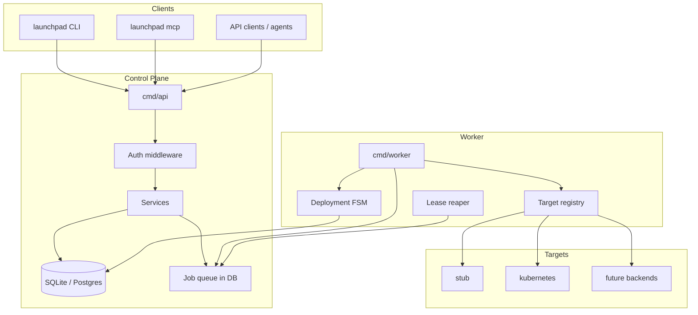

# Launchpad System Design

| Field | Value |
|-------|-------|
| **Status** | Active |
| **Date** | 2026-07-09 |
| **Domain model** | [`docs/DOMAIN.md`](DOMAIN.md) — authoritative for entities, invariants, and roadmap |
| **In-flight** | [`specs/2026-07-09-release-invariants-design.md`](superpowers/specs/2026-07-09-release-invariants-design.md) |

---

## Overview

Launchpad is a self-hosted deployment control plane with a Heroku-inspired developer experience. Users manage **projects** (logical systems), stage changes in **changesets**, and deploy **releases** asynchronously to pluggable runtime backends.

The system separates **control plane** (API, auth, persistence, job queue) from **data plane** (target backends that apply manifests and observe runtime). The API returns quickly with job IDs; the worker performs long-running deploys.

**Domain model is defined in [`DOMAIN.md`](DOMAIN.md).** This document covers control-plane architecture, storage, async execution, and operational concerns.

### Shipped today (MVP + DX waves)

- Project / environment / service / process hierarchy
- Image-only releases, deploy worker, changeset workflow (implicit CLI staging; no `changeset` subcommand)
- Multi-env (ambient header + CLI `env *`), layered config (shared + service)
- Promote, rollback, preview, logs, audit, env clone, unstage-last
- Runtime depth: process command mutations + Procfile, portable health, immutable config Secrets, target extensions + capabilities
- Secret config at rest (AES-256-GCM when `LAUNCHPAD_SECRETS_KEY` is set); OpenAPI contract (`docs/openapi.yaml` + CI check)
- Stub and Kubernetes targets; process logs via target
- SQLite + Postgres storage, bootstrap token auth
- CLI: `projects create`, `use`, `env *`, `config`, `process`, `scale`, `image`, `deploy --wait`, `ps`, `releases`, `diff`, `inspect`, `logs`, `rollback`, `promote`, `target capabilities`, `doctor`, `context`, `export`, `apply`, `mcp`

### Roadmap

See [Phased roadmap](#phased-roadmap) in this doc and [`DOMAIN.md`](DOMAIN.md). **Shipped integrations:** yaml v1 + MCP. **Parked:** multi-service ReleaseSet, config bindings, OIDC. **Later:** workspace config layer, scale API, SSE/events, idempotency, builds, Helm. Disposition: [`program/feedback/2026-08-22-queue-disposition.md`](superpowers/program/feedback/2026-08-22-queue-disposition.md).

---

## Architecture


```mermaid
flowchart TB
    subgraph clients [Clients]
        CLI[launchpad CLI]
        MCP[launchpad mcp]
        API_CLIENT[API clients / agents]
    end

    subgraph control [Control Plane]
        API[cmd/api]
        AUTH[Auth middleware]
        SVC[Services]
        STORE[(SQLite / Postgres)]
        Q[Job queue in DB]
    end

    subgraph async [Worker]
        WORKER[cmd/worker]
        REAPER[Lease reaper]
        FSM[Deployment FSM]
        REG[Target registry]
    end

    subgraph targets [Targets]
        STUB[stub]
        K8S[kubernetes]
        FUTURE[future backends]
    end

    CLI --> API
    MCP --> API
    API_CLIENT --> API
    API --> AUTH --> SVC --> STORE
    SVC --> Q
    WORKER --> Q
    REAPER --> Q
    WORKER --> FSM --> STORE
    WORKER --> REG
    REG --> STUB
    REG --> K8S
    REG --> FUTURE
```

### Request flow (deploy)

1. Client `POST /v1/projects/{project}/releases` or `changeset/push`.
2. **Single API/service transaction:**
   - For push: apply staged config/scale to live tables, then snapshot.
   - Snapshot `config_resolved` + full `process_snapshot` + artifact.
   - Create release → create deployment → enqueue job → (push only) mark changeset `committed`.
   - Commit TX (or roll everything back). Return `202 Accepted`.
3. Worker leases job, transitions deployment `pending → deploying`, and **supersedes** any previous `running` deployment for the same service×env.
4. Worker builds `DeployRequest` **only from the release snapshot** (identity entities for naming/namespace; no live config/process reload).
5. Worker calls `Target.Deploy`.
6. On success: deployment `running`, release `succeeded`, project status cache `running`.
7. On failure: deployment `failed`, release `failed`; previous deployment remains `running` only if it was never superseded (failed before `deploying`).

---

## Repository layout

```
cmd/
  api/           # HTTP server
  worker/        # Job consumer
  launchpad/     # CLI
  migrate/       # Schema migrations

internal/
  domain/        # Types, FSM, invariants (no I/O)
  store/         # SQL repositories + migrations/
  service/       # Business logic
  api/           # chi handlers, RFC 7807 errors
  auth/          # Token auth, scopes
  jobs/          # Worker loop
  target/        # Target interface, kubernetes/, stub/
  cli/           # cobra commands

pkg/
  apiclient/     # Go client (CLI)
  launchpad/     # Shared errors

docs/
  DOMAIN.md      # Domain model (read first)
  DESIGN.md      # This file

scripts/         # Dev utilities (e.g. smoke-stub.sh)
mise.toml        # Go toolchain
```

---

## Components

| Component | Responsibility |
|-----------|----------------|
| `cmd/api` | REST API, auth, validation, enqueue jobs |
| `cmd/worker` | Poll/lease jobs, run deployment FSM, call targets |
| `cmd/launchpad` | User-facing CLI |
| `internal/store` | Persistence, transactions, migrations |
| `internal/service` | Project bootstrap, config, releases, changesets |
| `internal/target/*` | Backend-specific deploy/scale/status/logs |

Workers scale horizontally via `FOR UPDATE SKIP LOCKED` job leasing. API processes are stateless.

---

## Storage

| Environment | Database | Driver |
|-------------|----------|--------|
| Local dev | SQLite | `modernc.org/sqlite` |
| Production | Postgres 15+ | `pgx/v5` |

Migrations live in `internal/store/migrations/`. Local dev can auto-migrate via `LAUNCHPAD_AUTO_MIGRATE=true`.

### Core tables (MVP)

`workspaces`, `projects`, `environments`, `services`, `processes`, `config_vars`, `releases`, `deployments`, `changesets`, `changeset_changes`, `jobs`, `api_tokens`

Schema details and invariants: [`DOMAIN.md`](DOMAIN.md).

---

## Job queue

Jobs are stored in Postgres/SQLite (no separate queue service in MVP).

| Status | Description |
|--------|-------------|
| `queued` | Waiting for worker |
| `leased` | Worker holds lock |
| `succeeded` / `failed` / `dead` | Terminal |

Workers poll with `FOR UPDATE SKIP LOCKED` (Postgres) or equivalent SQLite behavior. A lease reaper resets expired leases every 30s.

**MVP job types:** `deploy` only.

---

## Deployment state machine

```
pending → deploying → running | failed
pending → cancelled
deploying → cancelled
running → superseded   (when newer deployment reaches deploying)
```

Release status (MVP): coupled to the deployment created with that release: `pending` → `succeeded` | `failed`.

Concurrency: at most one active (`pending`/`deploying`) deployment per `(service_id, environment_id)` via partial unique index; map DB conflicts to `409 Conflict`.

Supersede ownership: worker, in the same transaction as `pending → deploying`.

---

## Transactional boundaries

| Operation | Atomic unit |
|-----------|-------------|
| Immediate release (`POST .../releases`) | Snapshot + release + deployment + job + project status |
| Changeset push | Config/scale apply + snapshot + release + deployment + job + changeset `committed` + project status |
| Worker deploy start | Deployment `deploying` + supersede previous `running` |
| Worker deploy terminal | Deployment terminal status + release status + project status |

Live `config_vars` / `processes` rows are inputs **to snapshot creation**, not to the worker.

---

## Target interface

```go
// Processes and Config MUST be derived from Release by the worker.
type DeployRequest struct {
    Project     domain.Project
    Service     domain.Service
    Environment domain.Environment
    Release     domain.Release
    Processes   []domain.Process
    Config      map[string]string
}
```

MVP control plane only invokes **Deploy**. Other `Target` methods may exist for future APIs but are not called by the worker today.

| Target | Registration |
|--------|--------------|
| `stub` | Always available (tests, local smoke) |
| `kubernetes` | When kubeconfig available; disable with `LAUNCHPAD_ENABLE_KUBERNETES=false` |

K8s resources: `launchpad-{project}-{service}-{process}` in the environment namespace; config Secrets `launchpad-{project}-{service}-cfg-{hash}`.

**Runtime depth (shipped):** process command mutations + Procfile; portable health → readiness probes; immutable content-hashed config Secrets; namespaced `target_extensions` + capabilities (`GET /v1/targets/{type}/capabilities`). See `docs/superpowers/specs/2026-07-20-runtime-target-depth-design.md` and DOMAIN “Target Interface”.

---

## Authentication

Bootstrap via `LAUNCHPAD_BOOTSTRAP_TOKEN` when no admin tokens exist. Persistent tokens via `POST /v1/tokens`.

| Scope | Permissions |
|-------|-------------|
| `project:read` | GET projects, config, releases, processes, jobs |
| `project:write` | Create projects, patch config, stage changesets |
| `deploy` | Create releases, push changesets |
| `admin` | Token management |

Tokens are workspace-scoped. The default workspace `default` is seeded at migration.

---

## REST API (shipped)

Base path `/v1`. Errors: RFC 7807 (`application/problem+json`). Long operations return `202 Accepted`. JSON responses use **snake_case** DTOs (domain types are not serialized directly). Canonical contract: [`docs/openapi.yaml`](openapi.yaml).

```
POST   /v1/projects
GET    /v1/projects
GET    /v1/projects/{project}
GET    /v1/projects/{project}/config
PATCH  /v1/projects/{project}/config
GET    /v1/projects/{project}/environments
POST   /v1/projects/{project}/environments
GET    /v1/projects/{project}/environments/{name}
POST   /v1/projects/{project}/environments/{name}/clone
GET    /v1/projects/{project}/processes
GET    /v1/projects/{project}/logs
POST   /v1/projects/{project}/releases
GET    /v1/projects/{project}/releases
POST   /v1/projects/{project}/rollback
POST   /v1/projects/{project}/promote
GET    /v1/projects/{project}/changeset
POST   /v1/projects/{project}/changeset/changes
DELETE /v1/projects/{project}/changeset/changes/last
DELETE /v1/projects/{project}/changeset
POST   /v1/projects/{project}/changeset/push
GET    /v1/projects/{project}/preview
GET    /v1/targets/{type}/capabilities
GET    /v1/jobs/{id}
GET    /v1/audit
POST   /v1/tokens
GET    /healthz
```

Release source: `{"type":"image","image":"<artifact-ref>"}` only. Environment is ambient via **`X-Launchpad-Environment`** (default `dev`); service is the project's `primary_service` until multi-service.

---

## CLI (shipped)

CLI stages mutations into the open changeset; `deploy` calls push. There is no `changeset` subcommand — staging is implicit via `config`/`scale`/`image`/`process` and `deploy`. Environment is ambient (`env use` / `LAUNCHPAD_ENV`, default `dev`) via `X-Launchpad-Environment`.

| Command | API |
|---------|-----|
| `launchpad projects create` | `POST /v1/projects` |
| `launchpad use` | Writes project to `~/.launchpad/config` |
| `launchpad env list/create/use/clone` | `GET/POST …/environments`, `POST …/clone` |
| `launchpad config get` | `GET /config` (live, current env) |
| `launchpad config set/unset`, `scale`, `image`, `process set/unset/apply` | `POST …/changeset/changes` (`--now` → stage + push) |
| `launchpad diff` / `status` / `reset` / `unstage` | `GET …/changeset` (+ releases); `DELETE …/changeset` / `…/changes/last` |
| `launchpad deploy` | Optional stage + `POST …/changeset/push` |
| `launchpad ps` | `GET /processes` |
| `launchpad logs` / `inspect` | `GET /logs`; composite inspect |
| `launchpad releases` / `rollback` / `promote` | `GET /releases`; `POST …/rollback`; `POST …/promote` |
| `launchpad target capabilities` | `GET /v1/targets/{type}/capabilities` |
| `launchpad export` / `apply` | `GET …/manifest`; `POST …/manifest/apply` (stage only) |
| `launchpad mcp` | stdio MCP tools over existing REST (`pkg/apiclient`); no new routes |

Context: `LAUNCHPAD_PROJECT`, `LAUNCHPAD_ENV`, `LAUNCHPAD_TOKEN`, `LAUNCHPAD_API_URL`. Primary service is still implicit.

---

## Phased roadmap

| Phase | Status | Deliverable |
|-------|--------|-------------|
| **1 — MVP core** | **Shipped** | Project/env/service model, changeset, deploy, stub+K8s |
| **1b — Release invariants** | **Shipped** | Snapshot-only deploy, atomic push, API DTOs (see domain doc) |
| **2a — Multi-env** | **Shipped** | Ambient env, env CRUD, CLI `env *` |
| **2b — Layered config** | **Shipped** | Shared + service layers; resolve at release |
| **3 — Multi-service** | Parked | Multiple services, ReleaseSet, coordination modes |
| **4 — Bindings** | Parked with phase 3 | `${{ ref }}` config linking between services |
| **5 — Promotion** | **Shipped** (primary service) | `promote` across environments |
| **6 — Integrations** | **Shipped (v1 yaml + MCP)** | `launchpad.yaml` import/export; `launchpad mcp` stdio tools over OpenAPI |

Each phase updates domain → store → service → worker → api → cli → target together. Canonical phase narrative: [`DOMAIN.md`](DOMAIN.md).

---

## Future control-plane work

Not yet implemented; design targets retained for planning:

| Area | Intent |
|------|--------|
| **Observability** | Structured logs (slog), Prometheus metrics with route-template labels, OpenTelemetry |
| **Deployment events** | `deployment_events` table, SSE streams for deploy progress |
| **Idempotency** | `Idempotency-Key` header on mutating POSTs |
| **Rate limiting** | Per-token buckets; ingress as authoritative limiter in prod |
| **HA packaging** | Helm chart, API/worker replicas, migration Job, PDBs |
| **Builds** | In-cluster build service (Kaniko/Buildkit), `building` deploy state |
| **OIDC / interactive login** | Parked until second human user or hosted spike; generic OIDC first |
| **Scale as worker job** | Control-plane scale API enqueueing target Scale |

**Shipped (no longer future work):** secret config AES-256-GCM at rest (`LAUNCHPAD_SECRETS_KEY`, `internal/secrets`); OpenAPI contract (`docs/openapi.yaml`, `make openapi-check`, `openapi_contract_test`).

---

## Security notes

| Concern | MVP mitigation |
|---------|----------------|
| Stolen API token | Scoped tokens, revocation |
| Tenant crossover | Workspace ID enforced on every query |
| Config leakage in logs | Secret values redacted on control-plane reads; log redaction of known secret keys (planned) |
| K8s RBAC | Dedicated ServiceAccount per Launchpad install |
| Secret config at rest | AES-256-GCM (`v1:` ciphertext) when `LAUNCHPAD_SECRETS_KEY` is set; refuse secret writes without key |

Config vars with sensitivity `plain` are stored as UTF-8 plaintext. Vars with sensitivity `secret` are sealed with AES-256-GCM (requires `LAUNCHPAD_SECRETS_KEY` on API and worker). Access is also controlled via DB permissions and network policy.

---

## Local development

```bash
mise install
mise exec -- make build test
make migrate-up
LAUNCHPAD_BOOTSTRAP_TOKEN=dev-bootstrap-token make run-api   # terminal 1
LAUNCHPAD_DATABASE_URL="file:launchpad.db" make run-worker   # terminal 2
```

Smoke test: `scripts/smoke-stub.sh` (API + worker must be running).

Agent and contributor conventions: [`AGENTS.md`](../AGENTS.md).

---

## Related documents

| Document | Purpose |
|----------|---------|
| [`DOMAIN.md`](DOMAIN.md) | Entity model, invariants, full CLI/API target state, glossary |
| [`AGENTS.md`](../AGENTS.md) | AI agent conventions, MVP scope, skills |
| [`README.md`](../README.md) | Quick start and user-facing overview |
| [`docs/superpowers/specs/2026-07-04-mvp-core-greenfield-design.md`](superpowers/specs/2026-07-04-mvp-core-greenfield-design.md) | Completed MVP implementation record |