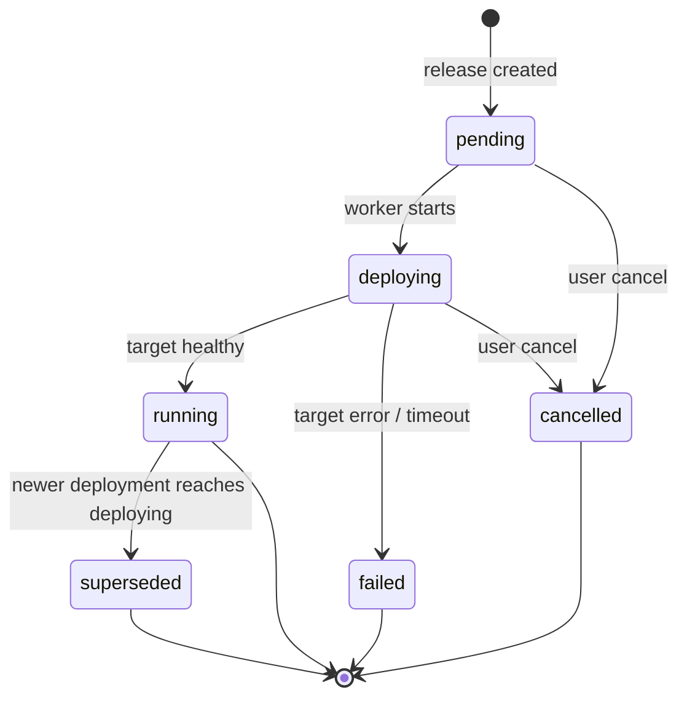

# Launchpad Domain Model

| Field | Value |
|-------|-------|
| **Status** | Active (revision 2) |
| **Date** | 2026-07-04 |
| **Related** | `docs/DESIGN.md` — control plane architecture and operational design |

---

## Purpose

This document defines Launchpad's **core domain and mental model**. It is the authoritative source for what entities exist, how they relate, and what invariants hold. All layers — API, CLI, TUI, worker, targets, plugins, and agent integrations — must conform to this model.

Design principle: **start from the developer experience, then adapt every layer to support it.** With the correct core model, we can build a great CLI, dashboards, tools, and integrations on top of a single coherent abstraction.

Launchpad aims to be the **mise of runtime application management**: zero ceremony for a solo engineer, composable depth for large distributed systems.

---

## Design Principles

1. **Separate what, where, and how.** A *project* is what you build. An *environment* is where it runs. A *service* is what deploys. A *process* is how it runs.
2. **Releases are immutable.** Never edit a release. Rollback creates a new release with a prior artifact.
3. **Config resolves at release time.** A release snapshot records the exact resolved config used for that deploy.
4. **Changesets stage intent.** Config, scale, and image changes stage by default; push materializes releases.
5. **Composition via refs, not inheritance.** Services link through typed bindings, not parent/child app trees.
6. **Environments own targets.** Projects own logic; environments own infrastructure bindings.
7. **Parallel by default, explicit when multi-service.** Single-service pushes deploy in parallel mode automatically. Pushes touching two or more services require an explicit coordination mode.

---

## Mental Model

### Context stack (CLI / API)

Users operate within a **context stack**, analogous to `kubectl` context or `mise use`:

| Context | Purpose | Default |
|---------|---------|---------|
| `workspace` | Auth and isolation boundary | From token |
| `project` | The system being managed | Required |
| `environment` | Where the system runs | `dev` |
| `service` | Which deployable unit (optional) | Project's `primary_service` |

```bash
launchpad use my-api              # set project
launchpad env use staging         # set environment
launchpad deploy --image ...      # deploys primary service in current env
```

Solo-engineer bootstrap creates: one project, one environment (`dev`), one service (same name as project), one process (`web`).

### Comparison to familiar tools

| Concept | Heroku (legacy) | Railway | Launchpad |
|---------|-----------------|---------|-----------|
| Product identity | App (per env) | Project | **Project** |
| Environment | Separate app | Environment | **Environment** |
| Deployable unit | App | Service | **Service** |
| Runtime role | Dyno type / process | Start command | **Process** |
| Staging changes | Immediate | Staged changes | **Changeset** |
| Cross-service config | Manual | Reference vars | **Bindings** |
| Promotion | Pipeline promote | Manual / workflow | **Promote release** |

---

## Entity Hierarchy

```mermaid
erDiagram
    Workspace ||--o{ Project : owns
    Workspace ||--o{ WorkspaceConfig : has
    Project ||--o{ Environment : has
    Project ||--o{ Service : contains
    Project ||--o| Changeset : "open (0..1)"
    Environment ||--o{ SharedConfig : has
    Environment ||--o{ TargetBinding : has
    Service ||--o{ Process : defines
    Service ||--o{ ServiceConfig : has
    Service ||--o{ Binding : declares
    Service ||--o{ Release : versions
    Release ||--o{ Deployment : triggers
    Environment ||--o{ Deployment : receives
    Deployment ||--o{ DeploymentEvent : logs
    Changeset ||--o{ ChangesetChange : contains
    ReleaseSet ||--o{ Release : groups
    ReleaseSet ||--o| Job : enqueues

    Workspace {
        uuid id PK
        string name UK
    }
    Project {
        uuid id PK
        uuid workspace_id FK
        string name UK_per_workspace
        string primary_service
        string status
    }
    Environment {
        uuid id PK
        uuid project_id FK
        string name UK_per_project
        string target_type
        json target_config
        bool ephemeral
    }
    Service {
        uuid id PK
        uuid project_id FK
        string name UK_per_project
        string kind
    }
    Process {
        uuid id PK
        uuid service_id FK
        string name UK_per_service
        string command
        int quantity
        string expose
    }
    Release {
        uuid id PK
        uuid service_id FK
        int version UK_per_service
        string artifact_ref
        json config_resolved
        json process_snapshot
        string status
        string description
    }
    Deployment {
        uuid id PK
        uuid service_id FK
        uuid environment_id FK
        uuid release_id FK
        string status
        string target_ref
    }
    Changeset {
        uuid id PK
        uuid project_id FK
        string status
    }
    ReleaseSet {
        uuid id PK
        uuid project_id FK
        uuid environment_id FK
        string coordination
        string status
    }
```

---

## Entities

### Workspace

Isolation and authentication boundary. Maps to the existing `teams` table internally; exposed as `workspace` in user-facing interfaces.

- Owns projects and workspace-scoped config.
- API tokens are scoped to a workspace.

### Project

The name in conversation: **"my-api"**, **"billing"**, **"commerce"**.

| Field | Description |
|-------|-------------|
| `name` | DNS-label safe, unique per workspace. Immutable in v1. |
| `primary_service` | Default service for commands that omit `--service`. |
| `status` | Aggregate health (derived from deployments). |

A project contains services, environments, shared config, and at most one open changeset. **Projects do not deploy directly.**

### Environment

A named slice of runtime reality within a project.

| Field | Description |
|-------|-------------|
| `name` | e.g. `dev`, `staging`, `production`, `pr-142`. Unique per project. |
| `target_type` | Pluggable backend: `kubernetes`, `stub`, future `nomad`, `ecs`. |
| `target_config` | Backend-specific config (namespace, cluster, region). |
| `ephemeral` | `true` for review/PR environments; subject to auto-cleanup. |

Each environment has its own target binding, shared config layer, and deployment state per service.

**Replaces** the current pattern of creating a separate app per environment (e.g. `my-api-staging`, `my-api-prod`).

### Service

The **smallest independently versioned deployable unit**. Has its own artifact and release history.

| Field | Description |
|-------|-------------|
| `name` | Unique per project. e.g. `api`, `worker-batch`, `postgres`. |
| `kind` | `application` (default) or `resource` (future managed resources). |

**When to create a new service:**

| Situation | Model |
|-----------|-------|
| Same image, different commands (web + worker + release) | One service, multiple **processes** |
| Different images (monorepo API + batch worker) | Multiple **services** |
| Independent release cadence | Multiple **services** |
| Managed database (future) | Separate **service** with `kind: resource` |

### Process

A runtime role within a service. All processes in a service share the service's release artifact.

| Field | Description |
|-------|-------------|
| `name` | e.g. `web`, `worker`, `release`. Unique per service. |
| `command` | Overrides image CMD (Fly-style). Empty = image entrypoint. |
| `quantity` | Desired replica count. |
| `expose` | `http`, `tcp`, or `none`. Controls ingress/service generation. |

Default on project creation: one process named `web` with `quantity=1`, `expose=http`.

Targets map processes to infrastructure (e.g. K8s: one Deployment per process). The domain does not prescribe target mapping.

### Release

Immutable snapshot of desired state for a **service**. Versioned monotonically per service (v1, v2, …).

| Field | Description |
|-------|-------------|
| `artifact_ref` | Container image reference (digest-pinned when possible). |
| `config_resolved` | Fully resolved config at snapshot time (all layers + bindings). |
| `process_snapshot` | `{ "web": { "quantity": 2 }, "worker": { "quantity": 1 } }`. |
| `status` | `pending`, `succeeded`, `failed`. Coupled to deployment terminal state. |
| `description` | Human-readable label. |

**Invariants:**

1. Releases are immutable once created.
2. Release version is monotonically increasing per service.
3. `config_resolved` is computed at release creation, not at runtime.

### Deployment

Async application of a release to a **service × environment** pair.

| Field | Description |
|-------|-------------|
| `status` | See [Deployment State Machine](#deployment-state-machine). |
| `target_ref` | Opaque backend reference (e.g. K8s deployment names). |
| `active` | At most one non-terminal deployment per (service, environment). |

**Concurrency:** enforced by partial unique index on `(service_id, environment_id)` where status ∈ (`pending`, `deploying`).

### Changeset

Project-scoped staging area for pending mutations. At most one open changeset per project.

| Status | Meaning |
|--------|---------|
| `open` | Accepting changes. |
| `committed` | Pushed; linked to a ReleaseSet. |
| `discarded` | Reset by user. |

#### ChangesetChange

Each change targets a specific service:

| Type | Payload | Example |
|------|---------|---------|
| `config` | `{ key, value? }` | `PORT=3000`; `value: null` deletes |
| `scale` | `{ process, quantity }` | `web=3` |
| `image` | `{ artifact_ref }` | `api:v2.1.0` |
| `binding` | `{ key, ref }` | `DATABASE_URL → services.postgres.config.DATABASE_URL` |

Changes accumulate in order; later changes to the same key override earlier ones.

### ReleaseSet

Coordination primitive created when a changeset is pushed (or on multi-service deploy). Groups one or more releases across services.

| Field | Description |
|-------|-------------|
| `coordination` | `parallel` or `atomic`. |
| `status` | `pending`, `running`, `succeeded`, `failed`, `partial` (parallel only). |
| `environment_id` | Target environment for all releases in the set. |

#### Coordination modes

| Mode | Behavior | When |
|------|----------|------|
| `parallel` | Each service deploys independently. Failures do not block siblings. | Default for single-service push. |
| `atomic` | All services must reach `running` or none do. Failure triggers rollback of succeeded siblings in the set. | Required when push touches 2+ services. |

**Rule:** If a changeset push affects exactly one service, `coordination` defaults to `parallel` and the mode flag is optional. If it affects two or more services, the client **must** specify `--mode parallel` or `--mode atomic`; otherwise the API returns `400 Bad Request`.

---

## Configuration Model

Config is organized in **layers**, resolved at release snapshot time. Later layers override earlier ones.

| Layer | Scope | Storage key | CLI flag |
|-------|-------|-------------|----------|
| **Workspace** | All projects in workspace | `(workspace_id, key)` | `--workspace` |
| **Shared** | Project + environment | `(project_id, environment_id, key)` | `--shared` |
| **Service** | Service in environment | `(service_id, environment_id, key)` | (default) |
| **Platform** | Computed by Launchpad | n/a (read-only) | n/a |

### Resolution order

```
workspace → shared(environment) → service → platform refs
```

Resolution produces the `config_resolved` map stored on the release. Targets receive only resolved values, never raw binding expressions.

### Bindings (service linking)

Services connect through **typed references** in config values, not parent/child hierarchy.

#### Reference syntax

```
${{ services.<name>.config.<KEY> }}
${{ services.<name>.endpoints.<process>.<public|internal> }}
${{ shared.<KEY> }}
${{ workspace.<KEY> }}
${{ platform.<KEY> }}
```

#### Examples

```bash
# Service: api (environment: staging)
DATABASE_URL=${{ services.postgres.config.DATABASE_URL }}
CHECKOUT_URL=${{ services.checkout.endpoints.web.internal }}

# Shared config (project: commerce, environment: staging)
LOG_LEVEL=debug
```

#### Binding rules

1. Refs resolve at release creation time for the target environment.
2. Circular refs are rejected at resolution with `422 Unprocessable Entity`.
3. Missing ref targets fail release creation with a clear error naming the unresolved ref.
4. Cross-project refs are deferred to v2.

#### When to use services vs. separate projects

| Relationship | Use |
|--------------|-----|
| Same team, same release cadence, shared changeset | Services in one **project** |
| Different teams, independent lifecycles | Separate **projects** (cross-project refs in v2) |

---

## Lifecycle Operations

### Changeset workflow

```bash
# Stage changes (service-aware)
launchpad changeset add --service api PORT=3000
launchpad changeset add --service api --scale web=3 --image api:v2
launchpad changeset add --service worker-batch --image batch:v1

# Review
launchpad changeset status

# Push — single service (parallel implicit)
launchpad changeset push --message "API config + scale"

# Push — multi-service (mode required)
launchpad changeset push --mode parallel --message "API + batch worker"
launchpad changeset push --mode atomic --message "Coordinated rollout"

# Discard
launchpad changeset reset
```

**Push flow:**

1. Validate changeset is non-empty and open.
2. Determine affected services.
3. If 2+ services and no `--mode`, reject.
4. Apply config/scale mutations to live state (within transaction).
5. Create one release per affected service (with resolved config + artifact).
6. Create ReleaseSet linking releases.
7. Enqueue deploy jobs (one per release).
8. Mark changeset `committed`.

Immediate operations (bypass staging):

```bash
launchpad deploy --service api --image api:v2 --now
launchpad scale --service api web=3 --now
launchpad rollback --service api 4 --now
```

### Deployment state machine



| From | To | Trigger |
|------|-----|---------|
| `pending` | `deploying` | Worker picks deploy job |
| `deploying` | `running` | Target reports ready |
| `deploying` | `failed` | Target error or timeout |
| `running` | `superseded` | New deployment for same service+env reaches `deploying` |
| `pending`, `deploying` | `cancelled` | User cancel |

Release status is coupled to deployment terminal state: `pending` → `succeeded` | `failed`.

### Rollback

Rollback creates a **new release** (version N+1) with the artifact and process snapshot from a prior succeeded release, then enqueues a deployment.

```bash
launchpad rollback --service api 4
# Creates release v(N+1) with description "Rollback to v4"
```

On failure, deployment → `failed`; the previous running deployment remains live.

### Promotion

Promote a succeeded release from one environment to another. The artifact stays identical; config is re-resolved against the target environment's layers.

```bash
launchpad promote --service api --from staging --to production --release 12
```

**Promotion flow:**

1. Read source release (artifact, process snapshot, non-env-specific config).
2. Re-resolve config against target environment's shared + service layers + bindings.
3. Create new release in target environment context (new version for that service).
4. Enqueue deployment to target environment.

Promotion does **not** copy environment-specific secrets or overrides — only the portable artifact and process topology.

---

## Target Interface

Targets implement runtime operations for a **service in an environment**. The domain model is target-agnostic; targets adapt.

```go
type DeployRequest struct {
    Project     Project
    Service     Service
    Environment Environment
    Release     Release
    Processes   []Process
    Config      map[string]string // resolved
}

type Target interface {
    Type() string
    Deploy(ctx context.Context, req DeployRequest) (*DeployResult, error)
    Scale(ctx context.Context, req ScaleRequest) error
    Destroy(ctx context.Context, req DestroyRequest) error
    Rollback(ctx context.Context, req RollbackRequest) (*DeployResult, error)
    Status(ctx context.Context, req StatusRequest) (*RuntimeStatus, error)
    Logs(ctx context.Context, req LogsRequest) (io.ReadCloser, error)
}
```

Resource naming convention (K8s): `launchpad-{project}-{service}-{process}` within the environment's namespace.

---

## API Conventions

### Shipped paths (MVP)

Workspace is implicit from the auth token. Environment is `dev`; service is the project's `primary_service`.

```
POST   /v1/projects
GET    /v1/projects
GET    /v1/projects/{project}
GET    /v1/projects/{project}/config
PATCH  /v1/projects/{project}/config
GET    /v1/projects/{project}/processes
POST   /v1/projects/{project}/releases
GET    /v1/projects/{project}/releases
GET    /v1/projects/{project}/changeset
POST   /v1/projects/{project}/changeset/changes
DELETE /v1/projects/{project}/changeset
POST   /v1/projects/{project}/changeset/push
GET    /v1/jobs/{id}
POST   /v1/tokens
GET    /healthz
```

### Planned paths

```
/v1/workspaces/{workspace}/projects/{project}/environments/{env}/...
/v1/projects/{project}/promote
/v1/projects/{project}/environments
Idempotency-Key header on mutating POSTs
```

### Headers (planned)

| Header | Purpose |
|--------|---------|
| `X-Launchpad-Environment` | Target environment (default: `dev` today) |
| `X-Launchpad-Service` | Target service (default: `primary_service`) |
| `Idempotency-Key` | Dedup on mutating POSTs |

---

## CLI Commands

### Shipped (MVP)

| Command | Notes |
|---------|-------|
| `launchpad projects create` | Bootstraps project + `dev` + primary service + `web` |
| `launchpad use <project>` | Persists context to `~/.launchpad/config` |
| `launchpad config get/set` | Service config in `dev` |
| `launchpad changeset add/status/push/reset` | Git-like staging |
| `launchpad deploy --image` | Immediate release |
| `launchpad ps` | Process list |
| `launchpad releases` | Release history |

### Planned

| Command | Action |
|---------|--------|
| `launchpad use <project>` | Set project context |
| `launchpad env use <env>` | Set environment context |
| `launchpad env list` | List environments |
| `launchpad env create <name> [--from <env>]` | Create environment |
| `launchpad services list` | List services in project |
| `launchpad config set [--shared\|--workspace] KEY=VAL` | Set config at layer |
| `launchpad config get` | Show resolved config for service+env |
| `launchpad changeset add --service <s> ...` | Stage changes |
| `launchpad changeset status` | Show staged changes |
| `launchpad changeset push [--mode parallel\|atomic]` | Push changeset |
| `launchpad changeset reset` | Discard changeset |
| `launchpad deploy --service <s> --image <ref> [--now]` | Deploy immediately |
| `launchpad releases [--service <s>]` | List releases |
| `launchpad ps [--service <s>]` | Process status |
| `launchpad scale --service <s> <process>=<n> [--now]` | Scale immediately |
| `launchpad rollback --service <s> <version> [--now]` | Rollback |
| `launchpad promote --service <s> --from <env> --to <env> --release <v>` | Promote release |
| `launchpad logs --service <s> --process <p>` | Stream logs |

### Bootstrap defaults

On `POST /v1/projects`:

1. Create project with `primary_service` = project name.
2. Create environment `dev` with supplied target config.
3. Create service (same name as project).
4. Create process `web` (quantity=1, expose=http).

---

## Key Invariants (complete)

1. Project names are unique per workspace, DNS-label safe.
2. Environment names are unique per project.
3. Service names are unique per project.
4. Process names are unique per service.
5. Release versions are monotonically increasing per service.
6. At most one open changeset per project.
7. At most one active deployment per (service, environment).
8. Releases are immutable.
9. `config_resolved` on a release is a complete snapshot — no lazy resolution at deploy time.
10. Multi-service changeset push requires explicit `coordination` mode.
11. Binding circular dependencies are rejected at release creation.
12. Promotion preserves artifact identity; only config is re-resolved.

---

## Phased Implementation

| Phase | Status | Domain changes | DX unlocked |
|-------|--------|----------------|-------------|
| **1 — MVP core** | **Done** | Project / Environment / Service; bootstrap; changeset; deploy | Solo-engineer project workflow |
| **2** | Planned | Layered config (workspace, shared, service); multi-env | `staging`/`prod`, shared settings |
| **3** | Planned | Service-aware changeset; ReleaseSet; coordination modes | Multi-service staging and deploy |
| **4** | Planned | Bindings and ref resolution | Service linking |
| **5** | Planned | Promotion API | staging → production flow |
| **6** | Planned | `launchpad.yaml` import/export | CI, agent, and tool integration |

Each phase updates API, store, worker, CLI, and target interface together.

---

## Open Questions

1. **Ephemeral environment TTL.** Default lifetime for `pr-*` environments? Recommendation: 7 days, configurable per project.
2. **Atomic rollback depth.** On atomic ReleaseSet failure, rollback only services deployed in this set, or all project services in the environment? Recommendation: only services in the set.
3. **Service discovery for platform refs.** Should `platform.*` include service mesh metadata? Defer to target-specific extensions.
4. **`launchpad.yaml` authority.** Import sets desired state; runtime mutations via API/CLI. File is not continuously reconciled (not GitOps). Defer to phase 6.

---

## Glossary

| Term | Definition |
|------|------------|
| **Artifact** | Immutable deployable image reference (container image in v1). |
| **Binding** | Config value containing a `${{ ... }}` reference to another source. |
| **Changeset** | Project-scoped staging area for pending config/scale/image/binding changes. |
| **Deployment** | Async operation applying a release to a service in an environment. |
| **Environment** | Named target binding within a project (dev, staging, production). |
| **Process** | Runtime role within a service (web, worker). Shares service artifact. |
| **Project** | Top-level logical system containing services and environments. |
| **Promotion** | Copying a release's artifact from one environment to another with config re-resolution. |
| **Release** | Immutable versioned snapshot of a service's desired state. |
| **ReleaseSet** | Coordinated group of releases across services from one changeset push. |
| **Service** | Independently versioned deployable unit with its own artifact and release history. |
| **Target** | Pluggable deployment backend (Kubernetes, etc.). |
| **Workspace** | Auth and config isolation boundary. |