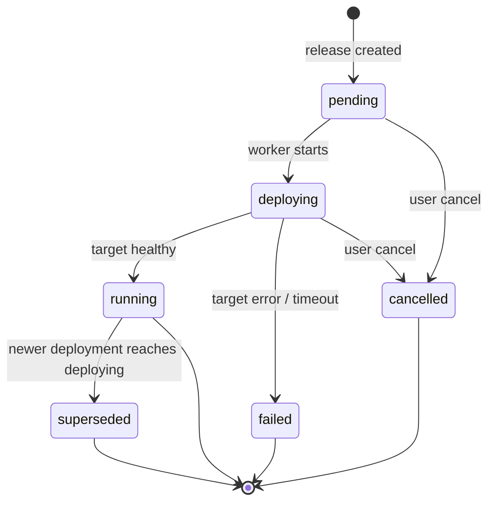

# Launchpad Domain Model

| Field | Value |
|-------|-------|
| **Status** | Active (revision 3) |
| **Date** | 2026-07-13 |
| **Related** | `docs/DESIGN.md` — control plane architecture and operational design |
| **Related** | `docs/superpowers/specs/2026-07-11-multi-env-design.md` — multi-env phase 2a |

---

## Purpose

This document defines Launchpad's **core domain and mental model**. It is the authoritative source for what entities exist, how they relate, and what invariants hold. All layers — API, CLI, TUI, worker, targets, plugins, and agent integrations — must conform to this model.

Design principle: **start from the developer experience, then adapt every layer to support it.** With the correct core model, we can build a great CLI, dashboards, tools, and integrations on top of a single coherent abstraction.

Launchpad aims to be the **mise of runtime application management**: zero ceremony for a solo engineer, composable depth for large distributed systems.

### Reading guide

| Section focus | Binding on current code? |
|---------------|--------------------------|
| Design principles, entities, **Key Invariants** | **Yes** — product truth |
| **MVP + 2a/2b** and shipped API/CLI tables | **Yes** — what runs on `main` |
| Multi-service, bindings, full Target surface | **Planned** — do not half-implement (2a multi-env, 2b layered config, primary-service promote **shipped**) |
| Phased implementation table | Roadmap; see “Known invariant debt” until closed |

---

## Design Principles

1. **Separate what, where, and how.** A *project* is what you build. An *environment* is where it runs. A *service* is what deploys. A *process* is how it runs.
2. **Releases are immutable.** Never edit a release. Rollback creates a new release with a prior artifact (and process snapshot).
3. **Config resolves at release time.** A release snapshot records the exact resolved config used for that deploy. **Deploy never re-reads live config tables.**
4. **The release is the deploy source of truth.** Targets receive desired state derived only from the release (artifact, `config_resolved`, `process_snapshot`). Live config/process rows are the **staging ground for the next release**, not what the worker applies.
5. **Changesets stage intent.** Config, scale, and image changes stage by default; push materializes releases **atomically** with job enqueue.
6. **Composition via refs, not inheritance.** Services link through typed bindings, not parent/child app trees.
7. **Environments own targets.** Projects own logic; environments own infrastructure bindings.
8. **Parallel by default, explicit when multi-service.** Single-service pushes deploy in parallel mode automatically. Pushes touching two or more services require an explicit coordination mode.

---

## Mental Model

### Context stack (CLI / API)

Users operate within a **context stack**, analogous to `kubectl` context or `mise use`:

| Context | Purpose | Default |
|---------|---------|---------|
| `workspace` | Auth and isolation boundary | From token |
| `project` | The system being managed | Required |
| `environment` | Where the system runs | `dev` |
| `service` | Which deployable unit (optional) | Project's `primary_service` |

```bash
launchpad use my-api              # set project
launchpad env use staging         # set environment
launchpad deploy --image ...      # deploys primary service in current env
```

Solo-engineer bootstrap creates: one project, one environment (`dev`), one service (same name as project), one process (`web`).

### Comparison to familiar tools

| Concept | Heroku (legacy) | Railway | Launchpad |
|---------|-----------------|---------|-----------|
| Product identity | App (per env) | Project | **Project** |
| Environment | Separate app | Environment | **Environment** |
| Deployable unit | App | Service | **Service** |
| Runtime role | Dyno type / process | Start command | **Process** |
| Staging changes | Immediate | Staged changes | **Changeset** |
| Cross-service config | Manual | Reference vars | **Bindings** |
| Promotion | Pipeline promote | Manual / workflow | **Promote release** |

---

## Entity Hierarchy

```mermaid
erDiagram
    Workspace ||--o{ Project : owns
    Workspace ||--o{ WorkspaceConfig : has
    Project ||--o{ Environment : has
    Project ||--o{ Service : contains
    Project ||--o| Changeset : "open (0..1)"
    Environment ||--o{ SharedConfig : has
    Environment ||--o{ TargetBinding : has
    Service ||--o{ Process : defines
    Service ||--o{ ServiceConfig : has
    Service ||--o{ Binding : declares
    Service ||--o{ Release : versions
    Release ||--o{ Deployment : triggers
    Environment ||--o{ Deployment : receives
    Deployment ||--o{ DeploymentEvent : logs
    Changeset ||--o{ ChangesetChange : contains
    ReleaseSet ||--o{ Release : groups
    Release ||--o{ Job : "deploy (via deployment)"

    Workspace {
        uuid id PK
        string name UK
    }
    Project {
        uuid id PK
        uuid workspace_id FK
        string name UK_per_workspace
        string primary_service
        string status
    }
    Environment {
        uuid id PK
        uuid project_id FK
        string name UK_per_project
        string target_type
        json target_config
        bool ephemeral
    }
    Service {
        uuid id PK
        uuid project_id FK
        string name UK_per_project
        string kind
    }
    Process {
        uuid id PK
        uuid service_id FK
        string name UK_per_service
        string command
        int quantity
        string expose
    }
    Release {
        uuid id PK
        uuid service_id FK
        int version UK_per_service
        string artifact_ref
        json config_resolved
        json process_snapshot
        string status
        string description
    }
    Deployment {
        uuid id PK
        uuid service_id FK
        uuid environment_id FK
        uuid release_id FK
        string status
        string target_ref
    }
    Changeset {
        uuid id PK
        uuid project_id FK
        string status
    }
    ReleaseSet {
        uuid id PK
        uuid project_id FK
        uuid environment_id FK
        string coordination
        string status
    }
```

---

## Entities

### Workspace

Isolation and authentication boundary. Stored in the `workspaces` table. (Some auth context keys still use legacy `team_id` naming; user-facing term is always **workspace**.)

- Owns projects and workspace-scoped config.
- API tokens are scoped to a workspace.
- Principals (users and service accounts) gain access via **workspace membership**.

### Principal (identity phase 1)

A **principal** is who acts: a human **user** or a non-human **service account** (CLI token, CI, agent).

| Field | Description |
|-------|-------------|
| `kind` | `user` \| `service_account` |
| `display_name` | Human-readable name (token name for SAs) |
| `email` | Optional; typical for users |
| `status` | `active` \| `disabled` |

**WorkspaceMember** links principal ↔ workspace with a role (`owner`, `admin`, `operator`, `viewer`). Phase 1 still authorizes API calls via **token scopes**; roles are stored for future policy and OIDC group mapping.

**APIToken** remains the automation credential and may reference `principal_id`. Creating a token mints a service account principal when none is supplied.

**Release attribution:** optional `created_by_principal_id` / `created_by_token_id` on releases. **AuditEvent** append-only log records mutating actions (deploy, promote, rollback, push).

**Deferred:** OIDC `Identity` links (Azure AD, Google, …), session login, SCIM. Spec: `docs/superpowers/specs/2026-07-14-identity-principals-design.md`.

### Project

The name in conversation: **"my-api"**, **"billing"**, **"commerce"**.

| Field | Description |
|-------|-------------|
| `name` | DNS-label safe, unique per workspace. Immutable in v1. |
| `primary_service` | Default service for commands that omit `--service`. |
| `status` | **Cached aggregate** health stored on the project row; updated when deploys are enqueued or reach a terminal state (not a pure live query). |

A project contains services, environments, shared config, and at most one open changeset. **Projects do not deploy directly.**

### Environment

A named slice of runtime reality within a project.

| Field | Description |
|-------|-------------|
| `name` | e.g. `dev`, `staging`, `production`, `pr-142`. Unique per project. |
| `target_type` | Pluggable backend: `kubernetes`, `stub`, future `nomad`, `ecs`. |
| `target_config` | Backend-specific config (namespace, cluster, region). |
| `ephemeral` | `true` for review/PR environments; subject to auto-cleanup. |

Each environment has its own target binding, shared config layer, and deployment state per service.

**Replaces** the current pattern of creating a separate app per environment (e.g. `my-api-staging`, `my-api-prod`).

### Service

The **smallest independently versioned deployable unit**. Has its own artifact and release history.

| Field | Description |
|-------|-------------|
| `name` | Unique per project. e.g. `api`, `worker-batch`, `postgres`. |
| `kind` | `application` (default) or `resource` (future managed resources). |

**When to create a new service:**

| Situation | Model |
|-----------|-------|
| Same image, different commands (web + worker + release) | One service, multiple **processes** |
| Different images (monorepo API + batch worker) | Multiple **services** |
| Independent release cadence | Multiple **services** |
| Managed database (future) | Separate **service** with `kind: resource` |

### Process

A runtime role within a service. All processes in a service share the service's release artifact.

| Field | Description |
|-------|-------------|
| `name` | e.g. `web`, `worker`, `release`. Unique per service. |
| `command` | Overrides image CMD (Fly-style). Empty = image entrypoint. |
| `quantity` | Desired replica count. |
| `expose` | `http`, `tcp`, or `none`. Controls ingress/service generation. |

Default on project creation: one process named `web` with `quantity=1`, `expose=http`.

Targets map processes to infrastructure (e.g. K8s: one Deployment per process). The domain does not prescribe target mapping.

### Release

Immutable snapshot of desired state for a **service**. Versioned monotonically per service (v1, v2, …).

| Field | Description |
|-------|-------------|
| `artifact_ref` | Container image reference (digest-pinned when possible). |
| `config_resolved` | Fully resolved config at snapshot time (all layers + bindings). |
| `process_snapshot` | Full process topology at snapshot time (see below). |
| `status` | `pending`, `succeeded`, `failed`. For MVP: coupled to the deployment created with this release. Multi-env meaning is deferred (phase 2+). |
| `description` | Human-readable label. |

**`process_snapshot` shape** (map of process name → snapshot):

```json
{
  "web": { "command": "", "quantity": 2, "expose": "http" },
  "worker": { "command": "run-worker", "quantity": 1, "expose": "none" }
}
```

Empty `command` means image entrypoint/CMD. Snapshot must be sufficient to build target process specs **without** reading the live `processes` table.

**Invariants:**

1. Releases are immutable once created.
2. Release version is monotonically increasing per service.
3. `config_resolved` and `process_snapshot` are computed at release creation, not at deploy time.
4. Workers and targets must not re-load live config/process rows for desired state.

### Deployment

Async application of a release to a **service × environment** pair.

| Field | Description |
|-------|-------------|
| `status` | See [Deployment State Machine](#deployment-state-machine). |
| `target_ref` | Opaque backend reference (e.g. K8s deployment names). |
| `active` | At most one non-terminal (`pending` / `deploying`) deployment per (service, environment). |

**Concurrency:** enforced by partial unique index on `(service_id, environment_id)` where status ∈ (`pending`, `deploying`). Application code maps violations to `409 Conflict`.

**Supersede:** When a deployment transitions to `deploying`, any previous `running` deployment for the same (service, environment) is marked `superseded` in the same transaction (worker-owned).

### Changeset

Project-scoped staging area for pending mutations. At most one open changeset per project.

| Status | Meaning |
|--------|---------|
| `open` | Accepting changes. |
| `committed` | Successfully materialized into release(s) + deploy job(s). Phase 3+: also linked to a ReleaseSet. |
| `discarded` | Reset by user. |

#### ChangesetChange

Each change targets a specific service:

| Type | Payload | Example |
|------|---------|---------|
| `config` | `{ key, value?, sensitivity? }` | `PORT=3000`; `value: null` deletes; `sensitivity: secret\|plain` |
| `scale` | `{ process, quantity }` | `web=3` |
| `image` | `{ artifact_ref }` | `api:v2.1.0` |
| `binding` | `{ key, ref }` | `DATABASE_URL → services.postgres.config.DATABASE_URL` |

Changes accumulate in order; later changes to the same key override earlier ones.

### ReleaseSet

Coordination primitive created when a changeset is pushed (or on multi-service deploy). Groups one or more releases across services.

| Field | Description |
|-------|-------------|
| `coordination` | `parallel` or `atomic`. |
| `status` | `pending`, `running`, `succeeded`, `failed`, `partial` (parallel only). |
| `environment_id` | Target environment for all releases in the set. |

#### Coordination modes

| Mode | Behavior | When |
|------|----------|------|
| `parallel` | Each service deploys independently. Failures do not block siblings. | Default for single-service push. |
| `atomic` | All services must reach `running` or none do. Failure triggers rollback of succeeded siblings in the set. | Required when push touches 2+ services. |

**Rule:** If a changeset push affects exactly one service, `coordination` defaults to `parallel` and the mode flag is optional. If it affects two or more services, the client **must** specify `--mode parallel` or `--mode atomic`; otherwise the API returns `400 Bad Request`.

---

## Configuration Model

Config is organized in **layers**, resolved at release snapshot time. Later layers override earlier ones.

| Layer | Scope | Storage key | CLI flag |
|-------|-------|-------------|----------|
| **Workspace** | All projects in workspace | `(workspace_id, key)` | `--workspace` |
| **Shared** | Project + environment | `(project_id, environment_id, key)` | `--shared` |
| **Service** | Service in environment | `(service_id, environment_id, key)` | (default) |
| **Platform** | Computed by Launchpad | n/a (read-only) | n/a |

### Resolution order

```
workspace → shared(environment) → service → platform refs
```

Resolution produces the `config_resolved` map stored on the release. Targets receive only resolved values, never raw binding expressions.

### Config sensitivity (S1 typing + S2 encryption)

Each config entry in **shared** and **service** layers has a sensitivity:

| Sensitivity | Default | Control-plane reads | Storage | Deploy |
|-------------|---------|---------------------|---------|--------|
| `plain` | yes | value returned | UTF-8 plaintext | full value |
| `secret` | no | value redacted as `***` | AES-256-GCM ciphertext (`v1:` prefix) | full value in process after decrypt |

**Rules:**

1. Sticky type on key: once `secret`, later sets without an explicit demote stay `secret`.
2. Promote to secret: `sensitivity: secret` or CLI `--secret`.
3. Demote to plain: requires explicit `sensitivity: plain` / CLI `--plain` (and a new value).
4. Each release stores `config_sensitivity` (map of key → type) alongside `config_resolved` for accurate archaeology when live types change later. Secret values in `config_resolved` are sealed at rest and opened in-process for the worker.
5. Workers still apply full plaintext from the release snapshot; targets are unchanged (`DeployRequest.Config` is always plaintext in memory).
6. Winning layer sensitivity applies (service override of shared is total).
7. **Key required for secret writes:** `LAUNCHPAD_SECRETS_KEY` (base64-encoded 32-byte AES key) must be set on **API and worker**. Missing key → refuse new secret writes; ciphertext fails closed on read/deploy. Pre-S2 plaintext secret rows remain readable until rewritten.

CLI: `launchpad config set --secret KEY=VAL`, `config get` shows `[secret]`. API: `GET …/config` redacts; `?view=typed` returns `{value, sensitivity, set}` (secret values null).

Env clone is available: plain values are copied; secret **keys** are reported as `needs_value` without copying material (`POST …/environments/{from}/clone`, CLI `env clone`).

### Bindings (service linking)

Services connect through **typed references** in config values, not parent/child hierarchy.

#### Reference syntax

```
${{ services.<name>.config.<KEY> }}
${{ services.<name>.endpoints.<process>.<public|internal> }}
${{ shared.<KEY> }}
${{ workspace.<KEY> }}
${{ platform.<KEY> }}
```

#### Examples

```bash
# Service: api (environment: staging)
DATABASE_URL=${{ services.postgres.config.DATABASE_URL }}
CHECKOUT_URL=${{ services.checkout.endpoints.web.internal }}

# Shared config (project: commerce, environment: staging)
LOG_LEVEL=debug
```

#### Binding rules

1. Refs resolve at release creation time for the target environment.
2. Circular refs are rejected at resolution with `422 Unprocessable Entity`.
3. Missing ref targets fail release creation with a clear error naming the unresolved ref.
4. Cross-project refs are deferred to v2.

#### When to use services vs. separate projects

| Relationship | Use |
|--------------|-----|
| Same team, same release cadence, shared changeset | Services in one **project** |
| Different teams, independent lifecycles | Separate **projects** (cross-project refs in v2) |

---

## Lifecycle Operations

### Changeset workflow

The **API** exposes project changesets (`GET/POST/DELETE …/changeset*`, `POST …/changeset/push`). The **CLI** stages implicitly: mutation commands write the open changeset; `deploy` submits (push). There is no user-facing `changeset` CLI command.

```bash
# Stage by default (MVP: primary service)
launchpad config set PORT=3000
launchpad scale web=3
launchpad image api:v2

# Review
launchpad status
launchpad diff          # staged vs last release

# Submit — single service (parallel implicit)
launchpad deploy -m "API config + scale"

# One-shot mutations + submit
launchpad deploy --image api:v3 PORT=8080 -m "bump"

# Immediate (clean staging only; --now on mutations)
launchpad config set DEBUG=true --now -m "debug"

# Discard
launchpad reset
```

Phase 3+ multi-service CLI (planned; still maps to changeset push with coordination):

```bash
# Future:
launchpad deploy --mode parallel -m "API + batch worker"
launchpad deploy --mode atomic -m "Coordinated rollout"
```

**Push flow (single database transaction for MVP single-service):**

1. Validate changeset is non-empty and open.
2. Determine affected services (MVP: primary service only).
3. If 2+ services and no `--mode`, reject (phase 3+).
4. Apply config/scale mutations to live tables (staging ground for the snapshot).
5. Resolve artifact (from staged image change, or latest succeeded release).
6. Create one release per affected service (`config_resolved` + full `process_snapshot` + artifact).
7. Create deployment(s) and enqueue deploy job(s).
8. Mark changeset `committed`.
9. **Commit transaction.** On any failure before commit: no live mutations, changeset remains `open`, no job.

Phase 3+: step 6–7 also create a **ReleaseSet** and honor coordination mode. Still one logical transaction.

**Immediate operations** (`--now` on mutation commands when staging is empty; still create a **new release** via stage+push — runtime changes do not skip the snapshot model):

```bash
launchpad image api:v2 --now -m "bump image"
launchpad scale web=3 --now -m "scale web"
# Future:
launchpad rollback 4 --now      # new release copying artifact + process_snapshot from v4
```

`--now` is **rejected** if any changes are already staged (use `diff` / `deploy` / `reset` first). There is **no** MVP control-plane path that mutates runtime desired state without a release.

### Deployment state machine



| From | To | Trigger |
|------|-----|---------|
| `pending` | `deploying` | Worker picks deploy job |
| `deploying` | `running` | Target reports ready |
| `deploying` | `failed` | Target error or timeout |
| `running` | `superseded` | New deployment for same service+env reaches `deploying` |
| `pending`, `deploying` | `cancelled` | User cancel |

Release status (MVP): coupled to the deployment created with that release: `pending` → `succeeded` | `failed`. Under multi-env, environment-specific outcomes live on **Deployment**; release status semantics will be refined in phase 2.

### Rollback

Rollback creates a **new release** (version N+1) with the **artifact and process_snapshot** from a prior succeeded release, then enqueues a deployment. Config is re-resolved for the target environment at rollback time (same as a new deploy of that topology), unless product policy later freezes config — default: re-resolve config, copy process topology + artifact.

```bash
launchpad rollback --service api 4
# Creates release v(N+1) with description "Rollback to v4"
```

On failure, deployment → `failed`; the previous running deployment remains live (until a later deploy supersedes it).

### Promotion

Promote a succeeded release from one environment to another. The artifact and process topology stay identical; **all config layers are re-resolved** in the target environment. Do **not** copy `config_resolved` from the source release.

```bash
launchpad env use production
launchpad promote --from staging --wait
# or fully explicit:
launchpad promote --from staging --to production --release 12 -m "ship"
```

**Selection rules:**

1. Source release must be `succeeded`.
2. Source must have a deployment in `from` with status `running` or `superseded`.
3. `from` and `to` must differ.
4. Omit `--release` / `version` → use the release of the latest `running` deployment in `from`.
5. Ambient `X-Launchpad-Environment` (or CLI sticky env) defaults **`to`** when body/flag omits it.

**Promotion flow:**

1. Read source release (`artifact_ref`, `process_snapshot` only for portable desired topology).
2. Re-resolve config against target environment's layers (+ bindings when they exist).
3. Create **new** release (new monotonic version for that service) with re-resolved config.
4. Enqueue deployment to target environment.

---

## Target Interface

Targets implement runtime operations for a **service in an environment**. The domain model is target-agnostic; targets adapt.

### Deploy contract (normative)

Desired state for deploy comes **only** from the release. Callers (worker) may expand the release into process/config fields for backend convenience:

```go
type DeployRequest struct {
    Project     Project
    Service     Service
    Environment Environment
    Release     Release                 // source of truth
    Processes   []Process               // MUST be derived from release.ProcessSnapshot
    Config      map[string]string       // MUST be derived from release.ConfigResolved
}
```

Workers **must not** populate `Processes` / `Config` from live `processes` or `config_vars` tables.

### MVP surface vs planned capabilities

| Capability | MVP control plane | Target implementations today |
|------------|-------------------|------------------------------|
| `Deploy` | **Used** | Required |
| `Logs` | **Shipped** (API/CLI read path) | stub + kubernetes |
| `Status` | Partial (`ps` / inspect via control plane) | stub helpers |
| `Scale` / `Destroy` / target-side `Rollback` | **Not exposed** as worker jobs | May exist as stubs or helpers for later phases |

Do not grow control-plane callers for Scale/Destroy until those features are in-scope. Optional interface split can follow then.

Resource naming convention (K8s): `launchpad-{project}-{service}-{process}` within the environment's namespace.

---

## API Conventions

### Serialization

- JSON field names are **snake_case**.
- Domain structs are **not** the wire schema; handlers use explicit response DTOs (or tagged view types).
- Errors: RFC 7807 `application/problem+json` (including auth failures).
- Long operations return `202 Accepted` with deployment + job identifiers.

### Shipped paths (MVP)

Workspace is implicit from the auth token. Environment is selected via **`X-Launchpad-Environment`** (default `dev`). Service is the project's `primary_service` until multi-service.

```
POST   /v1/projects
GET    /v1/projects
GET    /v1/projects/{project}
GET    /v1/projects/{project}/config          # ?layer=shared|service|resolved
PATCH  /v1/projects/{project}/config
GET    /v1/projects/{project}/environments
POST   /v1/projects/{project}/environments
GET    /v1/projects/{project}/environments/{name}
GET    /v1/projects/{project}/processes
POST   /v1/projects/{project}/releases
GET    /v1/projects/{project}/releases
POST   /v1/projects/{project}/rollback
POST   /v1/projects/{project}/promote
GET    /v1/projects/{project}/logs
GET    /v1/projects/{project}/changeset
POST   /v1/projects/{project}/changeset/changes
DELETE /v1/projects/{project}/changeset
POST   /v1/projects/{project}/changeset/push
GET    /v1/projects/{project}/preview   # pending vs baseline; ?from_release=&to_release=
GET    /v1/jobs/{id}
POST   /v1/tokens
GET    /v1/audit
GET    /healthz
```

| Header | Purpose | Status |
|--------|---------|--------|
| `X-Launchpad-Environment` | Target environment (default `dev`) | **Shipped** (phase 2a) |
| `X-Launchpad-Service` | Target service (default `primary_service`) | Planned (phase 3) |
| `Idempotency-Key` | Dedup on mutating POSTs | Planned |

### Planned paths

```
/v1/workspaces/{workspace}/projects/{project}/...
```

---

## CLI Commands

### Shipped (MVP)

| Command | Notes |
|---------|-------|
| `launchpad projects create` | Bootstraps project + `dev` + primary service + `web` |
| `launchpad new [recipe] <name>` | CLI recipe bootstrap (create + context + optional stage) |
| `launchpad use <project>` | Persists project context to `~/.launchpad/config` (+ project-local if present) |
| `launchpad prompt` / `shell-init` | Shell prompt fragment `project@env` |
| `launchpad env list/create/use/current/clone` | Environments; sticky env (default `dev`); dirty batch blocks switch; clone copies plain config only |
| `launchpad config get/set/unset` | Live get; set/unset stage by default (`--now` for immediate) |
| `launchpad scale` / `image` | Stage scale or image (`--now` for immediate) |
| `launchpad diff` / `status` / `reset` / `unstage` | Review pending vs last deploy **in current env**; discard all staging, or unstage last mutation |
| `launchpad deploy` | Submit staged batch; optional one-shot mutations (`--image`, `KEY=VAL`, `--scale`) |
| `launchpad ps` | Process definitions |
| `launchpad releases` | Release history with per-env deployment annotations |

### Shipped (post-MVP deltas)

| Command | Notes |
|---------|-------|
| `launchpad logs [process]` | Target-backed process logs |
| `launchpad inspect` | Project@env snapshot |
| `launchpad releases show N` | Full release snapshot |
| `launchpad diff --from-release N --to-release M` | Release↔release archaeology |
| `launchpad diff --from-env A --to-env B` | Env↔env: last deployed release snapshots |
| `launchpad rollback N` | New release from prior version; config re-resolved |
| `launchpad config … --layer shared\|service` | Layered config (2b); workspace layer deferred |
| `launchpad promote --from … [--to …]` | Cross-env promote; config re-resolved in target |

### Planned (deltas from shipped)

| Command | Action |
|---------|--------|
| `launchpad services list` | Multi-service projects |
| `launchpad config set --workspace` | Workspace config layer |
| `launchpad deploy --mode` / multi-service staging | Multi-service + coordination |

### Bootstrap defaults

On `POST /v1/projects`:

1. Create project with `primary_service` = project name.
2. Create environment `dev` with supplied target config.
3. Create service (same name as project).
4. Create process `web` (quantity=1, expose=http).

---

## Key Invariants (complete)

1. Project names are unique per workspace, DNS-label safe.
2. Environment names are unique per project.
3. Service names are unique per project.
4. Process names are unique per service.
5. Release versions are monotonically increasing per service.
6. At most one open changeset per project; when non-empty it is **pinned** to one environment.
7. At most one active (`pending`/`deploying`) deployment per (service, environment).
8. Releases are immutable after create.
9. `config_resolved` and `process_snapshot` are complete at release creation — **no live-table reload at deploy time**.
10. Push materialization (config/scale + release + deployment + job + changeset commit) is **one transaction**.
11. Multi-service changeset push requires explicit `coordination` mode (phase 3+).
12. Binding circular dependencies are rejected at release creation (phase 4+).
13. Promotion preserves artifact + process topology; config is fully re-resolved (phase 5+).

---

## Phased Implementation

| Phase | Status | Domain changes | DX unlocked |
|-------|--------|----------------|-------------|
| **1 — MVP core** | **Shipped** (hierarchy, API, CLI, deploy loop) | Project / Environment / Service; bootstrap; changeset; deploy | Solo-engineer project workflow |
| **1b — Release invariants** | **Shipped** | Snapshot-only deploy; atomic push; full process snapshot; snake_case API DTOs | Domain promises match runtime |
| **2a — Multi-env** | **Shipped** | Ambient env header; env CRUD; changeset env pin; CLI `env *` | `staging`/`prod` without app rename |
| **2b — Layered config** | **Shipped** | Shared + service layers; resolve at release | Shared settings per env |
| **3** | Planned | Service-aware changeset; ReleaseSet; coordination modes | Multi-service staging and deploy |
| **4** | Planned | Bindings and ref resolution | Service linking |
| **5** | **Shipped** (primary-service promote) | Promotion API + CLI | staging → production flow |
| **6** | Planned | `launchpad.yaml` import/export | CI, agent, and tool integration |

Each phase updates API, store, worker, CLI, and target interface together.

---

## Open Questions

1. **Env clone.** **Shipped** — plain copy; secret keys as `needs_value` only (no secret material).
2. **Ephemeral environment TTL.** Default lifetime for `pr-*` environments? Recommendation: 7 days, configurable per project.
3. **Atomic rollback depth.** On atomic ReleaseSet failure, rollback only services deployed in this set, or all project services in the environment? Recommendation: only services in the set.
4. **Service discovery for platform refs.** Should `platform.*` include service mesh metadata? Defer to target-specific extensions.
5. **`launchpad.yaml` authority.** Import sets desired state; runtime mutations via API/CLI. File is not continuously reconciled (not GitOps). Defer to phase 6.
6. **Release status under multi-env.** Refine when phase 2 lands; MVP ties release status to the single deploy created with the release.
7. **Rollback config policy.** Default above is re-resolve config + copy process topology/artifact; revisit if users need bit-identical config rollback.

---

## Glossary

| Term | Definition |
|------|------------|
| **Artifact** | Immutable deployable image reference (container image in v1). |
| **Binding** | Config value containing a `${{ ... }}` reference to another source. |
| **Changeset** | Project-scoped staging area for pending config/scale/image/binding changes. |
| **Deployment** | Async operation applying a release to a service in an environment. |
| **Environment** | Named target binding within a project (dev, staging, production). |
| **Process** | Runtime role within a service (web, worker). Shares service artifact. |
| **Project** | Top-level logical system containing services and environments. |
| **Promotion** | Copying a release's artifact from one environment to another with config re-resolution. |
| **Release** | Immutable versioned snapshot of a service's desired state. |
| **ReleaseSet** | Coordinated group of releases across services from one changeset push. |
| **Service** | Independently versioned deployable unit with its own artifact and release history. |
| **Target** | Pluggable deployment backend (Kubernetes, etc.). |
| **Workspace** | Auth and config isolation boundary. |